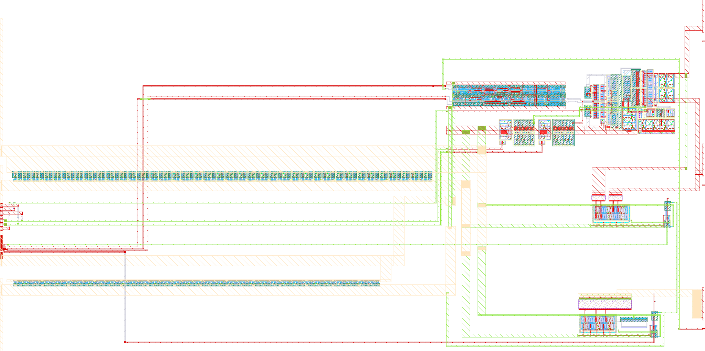

# Chipalooza Analog Project (ihp-sg13cmos5l)

(c) 2026 Tim Edwards and Simon Dorrer

> [!IMPORTANT]
> This repository requires the [IIC-OSIC-TOOLS](https://github.com/iic-jku/IIC-OSIC-TOOLS) container with tag `2026.08` or later.

> [!TIP]
> If you want to use `nix-shell` instead of the container, have a look here: [heichips26-template](https://github.com/HeiChips/heichips26-template).

> [!TIP]
> New to this flow? Start with the [**ihp-sg13cmos5l AMS chip design tutorial**](https://iic-jku.github.io/ihp-sg13cmos5l-ams-chip-template/index.html). This project follows the same analog flow and directory conventions, so the tutorial applies here as well.

<p align="center">
  <a href="render/img/slot_14_white.png">
    
  </a>
  <br>
  <em>Render of the ihp-sg13cmos5l slot_14 `tiny` layout (200um x 200um).</em>
</p>

This is the analog-on-top example project for Chipalooza 2026: the top level `slot_14` is drawn **by hand** in KLayout, based on one of the floorplan templates in `floorplan/`. It uses a **recursive macro structure**: the top level embeds the [`inverter`](macros/inverter/README.md) sub-macro, which shows the complete analog design flow (schematic → simulation → layout → DRC/LVS/PEX → post-layout simulation → characterization). For **mixed-signal (AMS)** submissions the digital [`counter`](macros/counter/README.md) sub-macro is shipped alongside it, which shows the complete digital flow (RTL → lint → RTL simulation → FPGA → LibreLane hardening → PEX → gate-level and mixed-signal simulation).

The whole flow runs inside the [IIC-OSIC-TOOLS](https://github.com/iic-jku/IIC-OSIC-TOOLS) container, which ships every tool it needs: Xschem, ngspice, Magic, Netgen, KLayout, CACE, LibreLane, Verilator, Icarus Verilog, cocotb, Yosys, and the `sak-*` helper scripts.

> [!IMPORTANT]
> The template name `sg13cmos5l_chipalooza_analog_project` is renamed to `slot_14`, the cell name of Chipalooza slot 14. [`submission.yaml`](submission.yaml) in the repository root carries it as `top-cell`, which has to match `TOP` in the [`Makefile`](Makefile).

[`submission.yaml`](submission.yaml) describes the submission and is what the precheck reads. It is filled in for this example and carries these fields:

| Field | Meaning |
| --- | --- |
| `project-name` | free-text name of the project |
| `top-cell` | the macro's cell name, unique across all submissions |
| `team-members` | one list entry per person |
| `slot-size` | `tiny` (200 µm × 200 µm), `small` (500 µm × 200 µm) or `large` (500 µm × 415 µm) |
| `analog-pins` | how many of `analog_0` … `analog_2` the macro uses, `0`–`3` |
| `short-description` | one line |
| `long-description` | the project documentation, Markdown in a YAML block scalar |
| `gds-path`, `lef-path`, `header-path` | globs for the three deliverables, each must match **exactly one** file |

Because the submission macro is the **top level** of this repository rather than a folder under `macros/`, the three paths are relative to the repository root:

```yaml
gds-path: final/gds/*.gds
lef-path: final/lef/*.lef
header-path: final/vh/*.vh
```

They are produced by `make build-top`, so run it once before submitting.

> [!WARNING]
> The precheck this template descends from rejects `analog-pins` greater than `0` unless `slot-size` is `small`, even though a `tiny` analog floorplan template is shipped and this example uses it (`tiny` with three analog pins). Confirm the rule with the organizers before you rely on a tiny analog slot.

To rename the project again, change `TOP` in the [`Makefile`](Makefile) — every target derives its file names from it, so nothing else in the Makefile has to be touched — and rename the files that carry the name:

- `layout/slot_14.gds`, `.klay.gds` and `.klay.klib`, **and the top cell inside both GDS files** (open in KLayout, rename the cell, save). The DRC, LVS and PEX targets pass the file name as the cell name, so the two must match.
- `schematic/xschem/slot_14.sch` and `.sym` (`_pex.sym` is regenerated by `symbol-pex`); `TOP` in `scripts/gen_top.py` writes all three
- `testbenches/xschem/slot_14_tb_tran.sch`, `slot_14_tb_lvds.sch`, `slot_14_tb_lvds_pads.sch`, `slot_14_tb_lvds_pex.sch` and `slot_14_wires.sym` (regenerated by `scripts/gen_top.py` and `scripts/sim/gen_tb_lvds_pads.py`)
- `testbenches/xschem/plot_simulations/plot_slot_14.py`
- `TOP` in `scripts/verify/check_drc.sh`, `check_lvs.sh` and `prepare_lvs.py`

Then search and replace the remaining occurrences inside those files — Xschem schematics and the plot script are plain text. The ones that matter are the DUT symbol instances and the `.include` of the PEX netlist in the testbench, and the raw file names in the plot script. Finally set `top-cell` in [`submission.yaml`](submission.yaml) to the same name.


## Directory Structure

<details>
<summary>Show Directory Structure</summary>

```text
📁 slot_14/
├─ 📁 final/
│  ├─ 📁 gds/
│  │  └─ slot_14.gds
│  ├─ 📁 lef/
│  │  └─ slot_14.lef
│  ├─ 📁 lib/
│  │  └─ slot_14.lib
│  └─ 📁 vh/
│     └─ slot_14.vh
├─ 📁 floorplan/
│  ├─ chipalooza_template_small.gds          # 500µm × 200µm slot
│  ├─ chipalooza_template_small_analog.gds   # 500µm × 200µm slot + 3 analog pins
│  ├─ chipalooza_template_tiny.gds           # 200µm × 200µm slot
│  └─ chipalooza_template_tiny_analog.gds    # 200µm × 200µm slot + 3 analog pins
├─ 📁 layout/
│  ├─ slot_14.gds          # exported tapeout GDS (read by every build and sign-off target)
│  ├─ slot_14.klay.gds     # KLayout editing source (live PCells + library references)
│  └─ slot_14.klay.klib    # library binding of the .klay.gds to macros/inverter/layout/inverter.gds
├─ 📁 macros/
│  ├─ 📁 counter/                            # digital example sub-macro for AMS designs (own Makefile & README)
│  └─ 📁 inverter/                           # analog example sub-macro (own Makefile & README)
├─ 📁 netlist/
│  ├─ 📁 layout/
│  │  ├─ *.cir                               # KLayout LVS extracted netlists
│  │  └─ *.ext.spc                           # Magic LVS extracted netlists
│  ├─ 📁 pex/
│  │  └─ *_magic_pex_*.spice
│  └─ 📁 schematic/
│     ├─ *.cdl                               # Xschem CDL netlists (KLayout LVS)
│     └─ *.spice                             # Xschem SPICE netlists (Magic + Netgen LVS)
├─ 📁 render/
│  └─ 📁 img/
│     ├─ slot_14_black.png
│     └─ slot_14_white.png
├─ 📁 schematic/
│  └─ 📁 xschem/
│     ├─ slot_14.sch
│     ├─ slot_14.sym
│     ├─ slot_14_pex.sym
│     └─ xschemrc
├─ 📁 scripts/
│  ├─ check_boundary.py
│  └─ check_pex_ports.py
├─ 📁 testbenches/
│  └─ 📁 xschem/
│     ├─ 📁 plot_simulations/
│     │  ├─ 📁 data/
│     │  ├─ 📁 figures/
│     │  ├─ ngspice2python.py
│     │  └─ plot_slot_14.py
│     ├─ slot_14_tb_lvds.sch             # 1: the schematic
│     ├─ slot_14_tb_lvds_pads.sch        # 2: pads + the wiring as laid out
│     ├─ slot_14_tb_lvds_pex.sch         # 3: pads + everything as laid out
│     ├─ slot_14_tb_tran.sch
│     ├─ slot_14_wires.sym
│     └─ xschemrc
├─ 📁 verification/
│  ├─ 📁 drc/
│  │  ├─ 📁 <cell>.klayout.drc/
│  │  └─ 📁 <cell>.magic.drc/
│  └─ 📁 lvs/
│     ├─ 📁 <cell>.klayout.lvs/
│     └─ 📁 <cell>.magic.lvs/
├─ Makefile
├─ README.md
└─ submission.yaml                             # submission description read by the precheck
```

</details>


## Recursive Macro Structure

This project embeds two sub-macros in `macros/`, and each level has its own Makefile with the same targets:

- **Top level (`slot_14`)** — the hand-drawn submission macro. Its layout instantiates `lvds_pattern`, `lvds_tx`, two `iref_x15`, `ref_odt` and `lvds_bt`. Its Makefile verifies and builds the **top cell only** (`CELL` defaults to `slot_14`).
- **Analog sub-macro ([`macros/inverter/`](macros/inverter/README.md))** — the complete flow reference for the unit `inverter` cell (`TOP = inverter`), including sizing notebooks and CACE characterization.
- **LVDS transmitter ([`macros/lvds_tx/`](macros/lvds_tx/README.md))** — pre-driver and current-steering output stage (`TOP = lvds_tx`), imported from the LVDS-PLL design repository. Layout drawn by hand, DRC, LVS and PEX clean, characterised with CACE.
- **LVDS pattern generator ([`macros/lvds_pattern/`](macros/lvds_pattern/README.md))** — `sg13cmos5l` standard cells only (`TOP = lvds_pattern`): latch-based clock gate, PRBS-7 generator and a matched complementary output pair. Feeds `lvds_tx`. The benches are generated from a cell table (`scripts/gen_schematic.py`); the schematic has moved ahead of it, see the macro README.
- **Bias pre-mirror ([`macros/iref_x15/`](macros/iref_x15/README.md))** — four HV transistors (`TOP = iref_x15`) turning a 2 uA `ibias` pin into the 30 uA `lvds_tx` needs; instantiated twice at the top level. Layout routed by hand.
- **`ref_clk` termination ([`macros/ref_odt/`](macros/ref_odt/README.md))** — switchable 50 ohm on pad 2 (`dig_in[0]`), rppd + HV switch + level shifter; schematic and layout generated from the IHP PCells.
- **LVDS back-termination ([`macros/lvds_bt/`](macros/lvds_bt/README.md))** — switchable ~200 ohm across the output pair (`dig_in[4]`), against the reflections the current-source driver would throw back; built like `ref_odt`, sharing its level shifter.
- **Digital sub-macro ([`macros/counter/`](macros/counter/README.md))** — the digital counterpart for **mixed-signal (AMS)** designs (`TOP = counter_top`). Its RTL is linted (Verilator), simulated (Icarus Verilog and cocotb), emulated on an FPGA and hardened into a placeable macro with LibreLane, which runs the Magic and KLayout DRC and the Netgen LVS as part of the flow. [`generate-xspice`](macros/counter/README.md#generate-xspice-file) turns the hardened netlist into an XSPICE model, so the digital block can be simulated together with analog circuitry in an Xschem testbench.

Every macro follows the same principle, and the simulations always run last, so they use the artifacts the same invocation has just produced:

| Makefile | `all` flow |
| --- | --- |
| [`macros/counter/`](macros/counter/) (digital) | lint → build (FPGA and LibreLane, including the XSPICE model) → extract (PEX of the hardened GDS) → simulate. DRC and LVS run inside the LibreLane flow. |
| [`macros/inverter/`](macros/inverter/) (analog) | verify (DRC, LVS, PEX) → build (LEF, LIB, Verilog stub, GDS, render) → simulate |
| top level | build macros → verify (DRC, LVS, PEX) → build (boundary check, LEF, LIB, Verilog stub, GDS, render) → simulate |

**Build order matters**: if you modify a sub-macro, run its own flow first (`make -C macros/inverter all` or `make -C macros/counter all`, or equivalently `make build-inverter` / `make build-counter` from here), then rebuild the top level. The top-level `make all` does this automatically by running `build-macros` before verifying and building the top cell. You can also remove the sub-macros entirely and draw everything flat in the top-level layout (not recommended).

> [!TIP]
> The example top level shipped here is **analog only**: it instantiates the `inverter` and leaves the `counter` unused, so nothing but `build-macros` touches it. To go mixed-signal, build the digital macro once with `make build-counter`, add its hardened GDS `macros/counter/final/gds/counter_top.gds` as a second library entry in [`layout/slot_14.klay.klib`](layout/slot_14.klay.klib) next to the `inverter` binding, place the `counter_top` cell in the top-level layout and re-export the tapeout GDS. `counter_top.sym` is already visible in a top-level Xschem session, see [Xschem Configuration](#xschem-configuration).


> [!NOTE]
> The layout sits on the frame of **slot 14** of
> [`RTimothyEdwards/sg13cmos5l_ocd_chipalooza`](https://github.com/RTimothyEdwards/sg13cmos5l_ocd_chipalooza)
> (`slot14_wrapper`, 537.15 × 273 µm). The floorplan templates below are the
> HeiChips-style ones this repository was seeded from; they no longer describe
> this project's pins.

## Project interface

The top cell `slot_14` carries the slot-14 frame pin for pin, and
`scripts/gen_top.py` generates its schematic and symbol from the same list, so
the top-level LVS compares the pin names as well:

```
vdd_3v3 vdd_1v2 vss_3v3 vss_1v2   supplies, TopMetal1 on the left edge
enable clk reset                   not connected
dig_in[23:0]                       24 shared digital inputs
dig_out[11:0]                      12 shared digital outputs  (not connected)
s14_an[2:0]                        the three dedicated analog pads, the pad itself
s14_an_0_esd s14_an_1_esd s14_an_2_esd   the same pads behind their secondary protection
ibias0 ibias1 vbias                shared current and voltage bias
analog_bus0 ... analog_bus3        shared analog buses
```

All three pads are `sg13cmos5l_IOPadAnalog`. Each has two core terminals:
`s14_an[i]` is the pad itself (`pad`), `s14_an_i_esd` goes through the pad's
secondary protection (`padres`).

| pad | core terminal | carries |
|---|---|---|
| 0 | `s14_an[0]` | `d_n`, LVDS out -, the pad direct; the switchable back-termination ([`lvds_bt`](macros/lvds_bt/README.md)) |
| 1 | `s14_an[1]` | `d_p`, LVDS out +, the pad direct; the switchable back-termination |
| 2 | `s14_an_2_esd` | `ref_clk` in, through the secondary protection (a gate input) |
| 2 | `s14_an[2]` | the switchable 50 ohm termination of `ref_clk` ([`ref_odt`](macros/ref_odt/README.md)), on the pad itself |

**Orientation in the chip.** The frame here is the harness's `slot14_wrapper`
pin for pin: `s14_an[0]` at the top (y 245-270 um), `s14_an[2]` at the bottom.
`chipalooza_frame.mag` places it with `transform -1 0 163230 0 1 320790`: mirrored
left-right only, so the analog pins at our right edge face the chip's left pad
ring (x 279 um) and every one of them lands level with its own pad -
`pad_s14_an_0` is the topmost of the three (y 1819-1901 um), `pad_s14_an_2` the
lowest. Top and bottom are not swapped.

`Out_n` sits above `Out_p` on `lvds_tx`, and pad 0 above pad 1 on the frame, so
the pair reaches its pads without crossing. The outputs take the pad direct: a
series resistor in an LVDS output would eat the swing. `ref_clk` is on pad 2,
next to the ground of `lvds_tx` and the mirrors, where the termination's 24 mA
return.

**`ref_clk`** wants a DC-coupled, ground-referenced clock of 0 ... 1.2 V at the
pad (threshold ~0.6 V, 50 % duty, one bit per period - up to 1 GHz, where
`lvds_pattern` is characterised). It goes through the pad's secondary
protection (~520 ohm, diodes to the 3.3 V IO ring) straight onto the clock gates
of `lvds_pattern`, where an `antennanp` clamps it to the 1.2 V rails as well. That
path stays clean beyond 4 GHz in simulation (tt and ss/125 C, 50 ohm source,
2 nH bond wire, 0.5 pF package); IHP's digital input cell `IOPadIn`, an HV inverter
on 1.2 V behind the same protection, would have stopped at 250 ... 500 MHz.

**Termination**, `dig_in[0]` = 1: 50 ohm from pad 2 to ground (`xodt`). Drive it
with a 50 ohm generator set to 0 ... 1.2 V into 50 ohm; it has to source 24 mA
while high. Without it (`dig_in[0]` = 0, the default), set the same generator to
0 ... 1.2 V into high-Z - its 50 ohm terminate the line at the source - or put
the termination on the board. Switch `dig_in[0]` on before the generator: a
generator set for a 50 ohm load doubles its swing at the open pad, 2.4 V on 1.2 V
gates.

**Back-termination**, `dig_in[4]` = 1: ~200 ohm across the output pair (`xbt`,
[`lvds_bt`](macros/lvds_bt/README.md)), with `ibias1` raised from IDAC code 6 to 9.
The driver is a current source and so throws back whole whatever the receiver
reflects - the receiver's own capacitance, the package and the bond wire make
sure something comes back. With the 200 ohm behind the pads two thirds of it are
absorbed, and the receiver sees a flat signal instead of a ringing one. The pair
then works into 100 || 200 ohm, so the driver needs 1.5 times the current for the
same |Vod|: that is the `ibias1` step, an IDAC setting. Over the CACE grid
(ss/tt/ff, -40/27/125 C, 2.97/3.3/3.63 V) |Vod| stays at 304-364 mV, Vos at
1.174-1.194 V, Vos p-p under 83 mV, the 3.3 V supply at 5.6-7.3 mA - against
345-394 mV, 1.191-1.195 V, 78 mV and 4.5-5.6 mA without. Off (`dig_in[4]` = 0,
the default, `ibias1` at code 6) the chip behaves as before. Turning it on
without raising `ibias1` costs a third of |Vod|; code 10 instead of 9 buys
back the 7 % it still costs at tt, for less headroom at 125 C.

Bias comes straight off the harness. `ibias0`/`ibias1` are the transmitter's
two references, sourced into the pins by the harness's 5-bit current DACs.
Taken here as linear up to 10 uA - one step 10/31 uA - the setting is code 6,
1.94 uA. Each goes through its own instance of
[`iref_x15`](macros/iref_x15/README.md), a 1:15 pre-mirror macro at the top
level (`xiref_pd`, `xiref_drv`), so the pre-driver and the driver see 29 uA,
close to the 30 uA they were characterised at; with the back-termination on,
`ibias1` goes to code 9 (2.90 uA, 43.5 uA at the driver). The 1.2 V common-mode
reference `Vref` comes from the harness's voltage reference on `vbias` (1.2 V is
on both of its scales).

**Taps.** `analog_bus0`, `analog_bus1` and `analog_bus2` reach `ibias0`, `vbias`
(`Vref`) and `ibias1` through 1.1 kohm each (`RT0`-`RT2`, rppd at the frame
edge). Through the harness's analog-bus switches each node can be measured - or
forced from outside, should the IDAC or the voltage reference not work: 2 uA drop
2 mV in the resistor, and the resistor keeps the bus capacitance and whatever is
coupled onto the bus off the bias nodes. `analog_bus3` is free.

`dig_in` map -- the housekeeping SPI routes every bit individually to a pin, a
constant or the sequencer, so a configuration bit costs a register write and no pin:

| bit | function |
|---|---|
| `dig_in[0]` | `odt` -- 1 = 50 ohm termination of `ref_clk` on |
| `dig_in[1]` | `en` -- gates the pattern clock |
| `dig_in[2]` | `reset` -- active high, seeds the PRBS |
| `dig_in[3]` | `mode` -- 0 = clock passthrough, 1 = PRBS-7 |
| `dig_in[4]` | `bt` -- 1 = ~200 ohm back-termination of the LVDS pair on (`ibias1` from code 6 to 9 with it) |
| `dig_in[23:5]` | unused |

Unselected, the harness holds every `dig_in` at zero, which leaves the clock
stopped and the output pair static -- a legal idle.

The PLL by Rahul Bhagwat (`macros/pll_*`) that clocked `lvds_pattern` through
`pll_clk` left this project on 2026-10-07 and continues as one of its own. Its
macros stay in the repository; the top level no longer uses them, and
`lvds_pattern` lost its clock source select (`pll_clk`, `clk_src`) the same day.

### Layout

`layout/slot_14.gds` is routed to the frame and verifies clean at the top level:
`make check` gives DRC clean (antenna rules included) and LVS matching with the
pin names compared. Everything after the hand-drawn floor plan
(`layout/slot_14_base.gds`) is scripted; `bash scripts/top/build_layout.sh`
runs the chain into `build/top/`, `--install` copies the result to `layout/`
(it refuses when `slot_14.klay.gds` holds an unsaved-over KLayout edit):

- **Floor plan** (`scripts/top/floorplan_shift.py`): the LVDS group --
  `lvds_pattern`, `lvds_tx`, both `iref_x15` -- sits 92.25 um above the drawn
  floor plan, so the middle of the output pair is level with the middle of
  pads 0 and 1.
- **Control lines** (`scripts/top/route_top.py`): `dig_in[1..3]` to `en`,
  `reset`, `mode` on 0.6 um Metal3 - 0.2 um only off the frame pins, which sit
  at a 0.44 um pitch, then fanned out onto their own tracks; `mode` crosses the
  other two on a Metal4 bridge. 2 x 2 Via2 onto each pin of `lvds_pattern`.
- **Supplies** on TopMetal1, crossing-free:
  `vdd_1v2`, `vss_1v2`, `vss_3v3`, `vdd_3v3` from their frame pins towards the
  blocks, each leaving its strap through TopVia1 onto a Metal4 riser that
  climbs to the block's supply stub (Via3).
- **Bias** on 1 um Metal4, over the Metal3 control lines: `ibias0` to
  `xiref_pd`, `ibias1` to `xiref_drv`, `vbias` to `xlvds.Vref` (first up the
  frame edge on Metal2, so all three climb without crossing); Via3
  arrays at both ends (4 x 4 at the frame pin, 2 x 2 at the stub).
- **Decoupling** as two standard-cell rows laid under the edges of the supply
  straps: 83 `sg13cmos5l_decap_8` on 1.2 V and 95 `sg13g2_hv_decap_8` on 3.3 V,
  each rail reached by a via stack (two cuts per level) every ~20 um. The schematic carries them as
  the arrays `xdc12` / `xdc33`.
- **Pads** (`scripts/top/route_pads.py`): `Out_n` climbs on Metal3 to pad 0,
  `Out_p` drops to pad 1 (~60 and ~80 um, no crossing); `ref_clk` comes from
  pad 2 up the right side on 1 um Metal4 and drops onto `lvds_pattern` from
  above, 2 x 2 Via3 and Via2 at its pin.
- **Termination**: `ref_odt` (64 x 33 um) beside pad 2, its pad line on
  TopMetal1, its ground and 3.3 V on Metal4 into the feet of the `vss_3v3` and
  `vdd_3v3` straps, `EN` from `dig_in[0]` on 0.6 um Metal3 and 1 um Metal2
  (`scripts/top/add_odt.py`).
- **Back-termination**: `lvds_bt` (64 x 28 um) below `lvds_tx`, `OUTP` on
  2 um Metal3 onto `Out_p`'s line, `OUTN` up on Metal4 over it to `Out_n`'s;
  ground and 3.3 V on Metal4 from the feet of the `vss_3v3` / `vdd_3v3` straps,
  1.2 V on from the termination's line, `EN` from `dig_in[4]` - the fifth line
  of the fan-out, then Metal4 along y 82.8 um (`scripts/top/add_bt.py`).
- **Antenna**: `en` and `mode` reach their gates over ~450 um of Metal3,
  `ref_clk` over ~430 um of Metal4; three `sg13cmos5l_antennanp` inside
  `lvds_pattern` protect them - the one on `ref_clk` also clamps the clock gates'
  input to their own 1.2 V rails. `reset` (~470 um of Metal3) has none in the
  macro: a `dantenna` 0.78 x 0.78 sits under its line 9 um before the pin,
  `DRST` in the top schematic. `EN` of the termination has its own inside
  `ref_odt`, `EN` of the back-termination inside `lvds_bt`.
- **One ground**: the harness ties `vss_1v2` and `vss_3v3`
  (`chipalooza_frame.v`: `assign vss3v3 = vss1v2`), and every tap of either sits
  in the same substrate, so the extraction merges them. The LVS joins the two
  nets in the reference as well, with both frame pins kept
  (`scripts/verify/README.md`).

Known gaps, all of them real:

- The `.subckt` port order differs from the frame because xschem groups outputs
  last. Instantiate by name, not by position.
- The harness `enable` has no load: `dig_in[1]` alone gates the pattern clock.
  The harness masks `dig_in` to zero for an unselected project
  (`proj_dig_in = {24{select & dig_ena}} & dig_in`), so an unselected project is
  still idle -- but `select` and `dig_ena` high with `enable` low leaves the
  block running with the project enable deasserted.
- `ref_clk` runs from the pad's secondary protection straight into a
  standard-cell input with no receiver; above 1.2 V at the pad it overdrives
  those gates (the antenna diode clamps it near 1.8 V through the ~520 ohm).
- ESD is not simulated: the PDK models have neither snapback nor oxide
  breakdown. The protection follows IHP's own input structure plus the clamps
  above; how the IO ring's `iovss` ties to the core grounds is up to the chip.
- The `ibias` direction and the IDAC codes follow the organisers' description
  (a 5-bit current source, taken as linear to 10 uA), not a measurement.

### Top-Level Testbenches

Three benches look at the same link from the schematic to the layout. All of
them send PRBS-7 at 500 Mb/s, bias each mirror with IDAC code 6 (1.94 uA) and
`vbias` with 1.2 V, and run the same 700 ns in three phases, so the ODT is seen
switching: `ref_clk` comes from a 50 ohm generator onto pad 2 (`s14_an[2]`,
where `xodt` hangs) through the pad's IO cell to `s14_an_2_esd`.

| Phase | ODT (`dig_in[0]`) | generator EMF | at pad 2 |
|---|---|---|---|
| A, 0-300 ns | off | 1.2 V | 1.2 V, no current |
| B, 300-400 ns | on | 1.2 V | halved to 0.6 V - 50 ohm into 50 ohm; the pattern stalls |
| C, 400-700 ns | on | 2.4 V (1.2 V into 50 ohm) | 1.2 V, 24 mA while high; reset at 400 ns, PRBS-7 again; the output back-termination on (`dig_in[4]`) with `ibias1` at code 9 |

Each bench prints the numbers per phase - the switch's gate `x1.xodt.enh`,
the node behind R1 `x1.xodt.x`, the pad voltage and current, Vod / Vos, the
supplies - and the ODT resistance from phase B, and shows them in waveform
panels next to the schematic (Simulate, then Load waves).

| Bench | The slot is | Around it | Run |
|---|---|---|---|
| `slot_14_tb_lvds` | the schematic, every block from its schematic | ideal sources on the slot pins, 49.9 + 49.9 ohm across pads 1 and 0 | `make sim-lvds` |
| `slot_14_tb_lvds_pads` | the **top-level wiring as laid out** (with its capacitance), the blocks from their schematics | the three `sg13cmos5l_IOPadAnalog` (PDK model), 2 nH bond wire, 0.5 pF package, 50 ohm line, 1 pF + 100 ohm receiver; `ref_clk` from a 50 ohm generator | `make sim-lvds-pads` |
| `slot_14_tb_lvds_pex` | **everything as laid out**: the wiring and every block from the extraction | as `slot_14_tb_lvds_pads` | `make sim-lvds-pex` |

Going down the table adds one thing at a time: the pads and the wiring between
them and the blocks, then the parasitics inside the blocks.

The two layout views come from one hierarchical Magic extraction of
`layout/slot_14.gds` with coupling capacitance, `make extract-top`
(`scripts/sim/extract_top.sh`), which writes `netlist/pex/slot_14_pex.spice`
and `netlist/pex/slot_14_wires.spice` (`scripts/sim/pex_top.py`). Run it again
after every layout change; the two `sim-` targets do. The benches call them
through `slot_14_pex.sym` / `testbenches/xschem/slot_14_wires.sym`, copies of
`slot_14.sym` with `type=primitive`. On the way, `pex_top.py`

- gives `vss_1v2` back as a port, joined to `vss_3v3` by 1 mohm - the
  extraction merges the two (one substrate);
- names what a bench reads as the schematic does: `x1.core_p` / `x1.core_n`
  (the pattern pair), `x1.xlvds.In_p` / `In_n`, the CMFB node
  `x1.xlvds.xdrv.cmfb` for the `.ic`;
- joins the n-diodes Magic leaves open - DN of `ref_odt` and the n-diode of
  every `sg13cmos5l_antennanp`: Magic reads their diffusion as not touching its
  contacts, while the layout has them (as on the `dpantenna` beside them,
  which Magic does connect) and the KLayout LVS connects them - to X and A,
  the nets they couple to most;
- in the wires view, calls each block by its schematic pins (matched by name)
  and moves the coupling from a top-level line to a node inside a block - a
  node the schematic block does not have - to ground, so every top-level net
  keeps its total capacitance.

Not in them: wire resistance (capacitance only - the longest top-level runs
are ~40 ohm on `ref_clk` and <3 ohm on the outputs), the harness's own wiring
from the slot edge to the pads, and ESD events.

One more: `slot_14_tb_tran` (40 ns from the schematic, `make sim-all`).

## Floorplan Templates

Start your top-level layout from one of the GDS templates in `floorplan/`. They define the slot geometry and all pin positions:

- **Signal pins** on Metal3 (west edge): the standard chip interface (`clk`, `ena`, `rst_n`, `ui_in[7:0]`, `uo_out[7:0]`, `uio_*[7:0]`) that connects your project to the eFPGA.
- **Analog pins** (`analog_0` … `analog_2`) on Metal2 (south edge) — only in the `*_analog` variants. Declare how many you use in [`submission.yaml`](submission.yaml) (`analog-pins:`), and see the warning above about which slot sizes may carry them.
- **Power straps** on Metal4, running **vertically all the way from bottom to top**: `VPWR`, `VGND`, and optionally `VAPWR` (analog supply). Keeping them as drawn is the safe default, because they line up with the chip power grid straight away. There is no hard requirement to do so — as a macro, the P&R tools can usually drop the power grid around your project as needed — but if you shorten, move or rename them, say so in [`submission.yaml`](submission.yaml) so the chip integration can take it into account.
- **PR boundary** on layer 189 (`prBoundary`), the box the chip flow derives the macro bounding box from, see [PR Boundary Check](#pr-boundary-check).

> [!TIP]
> There is no specific power-supply requirement for your project, and `TopMetal1` may be used. Leaving the top metals free makes the project easier to fold into a larger SoC later, and as a macro the P&R tools can usually drop the power grid around it as needed.


## Layout Sources and the Exported Tapeout GDS

`layout/slot_14.klay.gds` is the source of truth. It is the KLayout editing source: it references the PDK PCells and pulls the `inverter` cell in as a library through `layout/slot_14.klay.klib`, so every device is still live and editable. `layout/slot_14.gds` is exported from it with `File > Export Layout For Tapeout`, which resolves every PCell and library reference into a static cell, and it is what every build and sign-off target reads.

> [!IMPORTANT]
> Re-export after every layout change and never hand-edit `layout/slot_14.gds`. Keeping the two in step by editing both is how they drift apart, and the drift is invisible because the sign-off targets only look at the exported file.

The export re-evaluates the PCells against the **installed** PDK, so device geometry can change even though nobody touched the editing source. A layout carried over from another PDK revision or from a different template therefore has to be re-exported under the target PDK and re-checked, not copied. Re-run DRC, LVS and PEX after every export.

The `.klib` file binds the library name `inverter` to `../macros/inverter/layout/inverter.gds`. If you rename the sub-macro, update `lib_name` and `lib_path` there as well, otherwise KLayout cannot resolve the library instances when it opens the editing source.

The Makefile's `_GDS_EXT` variable picks `.gds` when it exists and falls back to `.klay.gds` otherwise, so the DRC, LVS and PEX targets work either way. The build targets (`check-boundary`, `lef`, `copy-gds`, `render-gds`) always read `layout/<TOP>.gds`.

To edit the layout, start KLayout in edit mode on the editing source from inside the container:

```sh
klayout -e layout/slot_14.klay.gds
```

or use [`make open`](#open-the-design-files), which opens a file browser with one button per design file and starts the right tool in the file's own directory.


## Xschem Configuration

Xschem reads exactly one `xschemrc` at start-up, and that file decides which symbol libraries are visible and where netlists and simulation output are written. This template ships one per folder that holds schematics:

| `xschemrc` | Belongs to |
| --- | --- |
| [`schematic/xschem/xschemrc`](schematic/xschem/xschemrc) | top-level schematics |
| [`testbenches/xschem/xschemrc`](testbenches/xschem/xschemrc) | top-level testbenches |
| [`macros/inverter/schematic/xschem/xschemrc`](macros/inverter/schematic/xschem/xschemrc) | inverter schematics |
| [`macros/inverter/testbenches/xschem/xschemrc`](macros/inverter/testbenches/xschem/xschemrc) | inverter testbenches |
| [`macros/inverter/verification/cace/templates/xschemrc`](macros/inverter/verification/cace/templates/xschemrc) | CACE testbench templates |
| [`macros/counter/schematic/xschem/xschemrc`](macros/counter/schematic/xschem/xschemrc) | counter schematics |
| [`macros/counter/testbenches/xschem/xschemrc`](macros/counter/testbenches/xschem/xschemrc) | counter testbenches |
| [`macros/lvds_tx/schematic/xschem/xschemrc`](macros/lvds_tx/schematic/xschem/xschemrc) | LVDS transmitter schematics |
| [`macros/lvds_tx/testbenches/xschem/xschemrc`](macros/lvds_tx/testbenches/xschem/xschemrc) | LVDS transmitter testbenches |
| [`macros/lvds_pattern/schematic/xschem/xschemrc`](macros/lvds_pattern/schematic/xschem/xschemrc) | LVDS pattern generator schematics |
| [`macros/lvds_pattern/testbenches/xschem/xschemrc`](macros/lvds_pattern/testbenches/xschem/xschemrc) | LVDS pattern generator testbenches |
| [`macros/iref_x15/schematic/xschem/xschemrc`](macros/iref_x15/schematic/xschem/xschemrc) | bias pre-mirror schematic |
| [`macros/iref_x15/testbenches/xschem/xschemrc`](macros/iref_x15/testbenches/xschem/xschemrc) | bias pre-mirror testbench |

### What Every File Does

All of them run the same four steps, in this order:

1. **Pick the PDK.** `PDK_ROOT` is probed in the usual install locations if the environment does not set it, and `PDK` falls back to `ihp-sg13cmos5l`. The container already exports `PDK_ROOT`, and [`.designinit`](.designinit) exports `PDK`, so this step is only a safety net for an Xschem started outside that environment.
2. **Source the PDK `xschemrc`.** `$PDK_ROOT/$PDK/libs.tech/xschem/xschemrc` brings in the IHP device symbols, the ngspice model paths and the IHP menu. It is guarded by `[info exists PDK]` so it is read once even when several project files are chained.
3. **Add the project library paths.** `append_xschem_library_path_unique` appends a folder to `XSCHEM_LIBRARY_PATH` only if it is not already there, so the same folder never appears twice no matter how the files are chained. [`testbenches/xschem/xschemrc`](testbenches/xschem/xschemrc) adds none of its own and gets its paths from the file it sources.
4. **Pin the netlist directory.** `pin_netlist_dir` decides where `xschem netlist` and the simulators write.

Both helper procedures are defined behind an `[info commands ...]` guard, so sourcing one file from another is harmless and the order does not matter.

### How the Files Are Chained

The top level pulls in everything below it:

```text
testbenches/xschem/xschemrc
└─ source schematic/xschem/xschemrc
   ├─ source macros/inverter/schematic/xschem/xschemrc
   └─ source macros/counter/schematic/xschem/xschemrc

macros/inverter/verification/cace/templates/xschemrc
└─ source macros/inverter/schematic/xschem/xschemrc
```

Each schematic folder puts itself and its sibling testbenches folder on the library path, and each testbenches folder does the reverse. The top level therefore sees all six schematic and testbench folders, which is what lets `slot_14.sch` instantiate `inverter.sym` and `counter_top.sym`, and what lets you open a macro testbench from a top-level session. The macro files do not source each other or the top level, so a macro can be opened and simulated on its own.

Add a further sub-macro to the top level by sourcing its `schematic/xschem/xschemrc` from [`schematic/xschem/xschemrc`](schematic/xschem/xschemrc), next to the `inverter` and `counter` lines.

### Where Netlists and Simulation Output Go

`pin_netlist_dir` maps the folder of the schematic being netlisted to a `simulations/` folder:

| Schematic lives in | `netlist_dir` |
| --- | --- |
| `<x>/testbenches/xschem` | `<x>/testbenches/xschem/simulations` |
| `<x>/schematic/xschem` | `<x>/testbenches/xschem/simulations` |
| `.../cace/templates` | `.../cace/templates/simulations` |
| anywhere else (a PDK example) | left at the value the `xschemrc` pinned |

It runs twice: once while the `xschemrc` is read, using that file's own folder, and again through Xschem's `load_file_postprocess` hook for every schematic that is opened afterwards. The second call is the important one. Because the top level puts the macro folders on the library path, a macro testbench can be opened from a top-level session, and without the hook its netlist would land in `testbenches/xschem/simulations/`. Its relative includes such as `.include ../../../netlist/pex/inverter_magic_pex_3.spice` are resolved by ngspice relative to the netlist file, so they would then point at the wrong tree and the simulation would abort. With the hook, the netlist always lands next to its own schematic and the includes resolve.

A `set netlist_dir` passed on the Xschem command line still wins, because `--command` runs after the file is loaded. The LVS netlist targets rely on this to write into `netlist/schematic/` instead.

All `simulations/` folders are generated and git-ignored.

### Which File Is Used

- The Makefile targets always name one explicitly with `--rcfile`, so a target behaves the same from any working directory.
- Starting Xschem from within one of the seven folders picks up that folder's file, which is the normal interactive case. `make open` does the same, because it starts Xschem in the file's own directory.
- Started from anywhere else, Xschem falls back to `~/.xschem/xschemrc` and sees neither the project symbols nor the pinned `netlist_dir`. Pass the file explicitly then, for example `xschem --rcfile schematic/xschem/xschemrc <file>`.


## Verification Scripts (`sak-*`)

The DRC, LVS, PEX, render and file-browser targets call the `sak-*` Swiss-Army-Knife scripts of the [IIC-OSIC-TOOLS](https://github.com/iic-jku/IIC-OSIC-TOOLS). They are pre-installed in the container and are on `PATH`, so the Makefiles call them by name and no copy is kept in this repository:

- `sak-drc.sh` — DRC with Magic or KLayout
- `sak-lvs.sh` — LVS with Magic + Netgen or KLayout
- `sak-pex.sh` — parasitic extraction with Magic
- `sak-pin-reorder.py` — reorders extracted `.subckt` pins to match an Xschem symbol
- `sak-render.py` — renders a layout GDS to PNG
- `sak-open.py` — the file browser behind `make open`

They read `PDK_ROOT`, `PDK`, `PDKPATH` and `STD_CELL_LIBRARY` from the environment. The container exports `PDK_ROOT`, and [`.designinit`](.designinit) exports the other three. IIC-OSIC-TOOLS sources `$DESIGNS/.designinit` at start-up, so the file is picked up automatically when this repository is the mounted design directory. If the repository sits in a subfolder of `$DESIGNS`, or you are in a shell that was not started that way, source it by hand before running any target:

```sh
source .designinit
```

Only two Python helpers are kept in [`scripts/`](scripts/), because they are specific to this template:

- [`scripts/check_boundary.py`](scripts/check_boundary.py) — the PR boundary check, see below
- [`scripts/check_pex_ports.py`](scripts/check_pex_ports.py) — checks that every port of a PEX netlist is really connected


## Makefile Targets

The Makefile is identical in structure to the inverter sub-macro's (same variables, same targets) with `TOP = slot_14` — see [`macros/inverter/README.md`](macros/inverter/README.md) for the full reference of every target, every parameter (`CELL`, `EXT_MODE`, `THRESHOLD`, `MINRES`, `MINDELAY`, `DRC_LEVEL`, `EV_PRECISION`, `TB`, `SCRIPT`, `OPEN_ARGS`) and every DRC level and PEX mode. In short:

```sh
make                                     # help: all targets and variables
make open                                # file browser for this folder (needs the VNC/X11 desktop)
make klayout-verify-all                  # KLayout DRC + LVS of the top cell
make magic-verify-all                    # Magic DRC + LVS + PEX of the top cell
make check-boundary                      # PR boundary box check of the top cell layout
make build-top                           # boundary check, LEF, LIB, Verilog stub, final GDS, render
make build-inverter                      # run the inverter sub-macro's full flow (make -C macros/inverter all)
make build-counter                       # run the counter sub-macro's full flow (make -C macros/counter all)
make build-macros                        # verify, build and simulate all sub-macros (counter and inverter)
make sim-all                             # run all top-level testbenches
make sim-lvds                            # bench 1: the schematic
make sim-lvds-pads                       # bench 2: pads + the top-level wiring as laid out
make sim-lvds-pex                        # bench 3: pads + everything as laid out
make sim-xschem                          # top-level transient (default: <CELL>_tb_tran)
make sim-xschem TB=<testbenchname>       # run another testbench
make sim-view-xschem                     # plot the results (default: plot_<CELL>)
make sim-view-xschem SCRIPT=<scriptname> # run another plotting script
make all                                 # build-macros + verify + build + simulate
make clean                               # delete the top level's generated files (final, netlist, render, reports, simulations)
make clean-inverter                      # run make clean in the inverter sub-macro
make clean-counter                       # run make clean in the counter sub-macro
make clean-macros                        # run make clean in all sub-macros (counter and inverter)
make clean-all                           # clean-macros + clean
```

The per-step targets behind these are the same as in the sub-macro and all take `CELL=<cellname>`: `klayout-drc`, `klayout-lvs-netlist`, `klayout-lvs`, `klayout-pex`, `klayout-verify`, `magic-drc`, `magic-lvs-netlist`, `magic-lvs`, `magic-pex`, `magic-verify`, `symbol-pex`, and the build steps `lef`, `lib`, `verilog`, `copy-gds`, `render-gds`. Run `make help` for the full list.

`build-counter` and `clean-counter` only descend into the digital macro. Its own targets — linting, the RTL and gate-level simulations, the FPGA build, the LibreLane flow and the XSPICE model — are documented in [`macros/counter/README.md`](macros/counter/README.md) and are run from that folder.


### Open the Design Files

Opens a file browser for this folder with `sak-open.py`, one button per design file, grouped by directory. Clicking a button launches the matching tool (Xschem, KLayout in edit mode, Magic, GTKWave, gaw, gvim) in the file's own directory:

```sh
make open
make open OPEN_ARGS=--all              # include the build outputs
make open OPEN_ARGS="--prune backups"  # skip one more directory name
```

> [!NOTE]
> This target needs a display. Run it inside the container's VNC/noVNC desktop or over X11 forwarding. In a shell-only container it stops with `cannot open a window`.

See [Open the Design Files](macros/inverter/README.md#open-the-design-files) in the sub-macro README for the full file-type-to-tool table and the pruning rules.


### PR Boundary Check

Checks that the top cell of `layout/<TOP>.gds` draws the PR boundary box on layer 189 (`prBoundary`). `build-top` runs it first:

```sh
make check-boundary
```

The chip flow derives the bounding box of every macro from this layer: Magic maps all datatypes of layer 189 to its boundary, and LibreLane's `Magic.StreamOut` runs `get_bbox.tcl` on every macro it places. A layout without the box fails the whole chip build with `Failed to extract PR boundary from GDSII view of macro '<TOP>'`, two flows away from the layout that caused it. The box comes with the floorplan templates in `floorplan/`, so treat it as part of the layout: never delete it as clutter, keep it in the KLayout editing source (`<TOP>.klay.gds`) so every re-export carries it, and hide it at render time with `sak-render.py -x` if it spoils a shot. The check runs [`scripts/check_boundary.py`](scripts/check_boundary.py), which also warns when the drawn geometry extends beyond the boundary box.

The sub-macros have no such target: the box is only needed by the cell the chip flow places, which is the top level.


### Differences to the Sub-Macro

- `sim-all` runs only the top-level testbenches (currently `slot_14_tb_tran`). The testbench simulates the schematic by default and includes the extracted PEX netlist by swapping the DUT to the `_pex` symbol for a post-layout run. That symbol, `schematic/xschem/<CELL>_pex.sym`, is built by the `symbol-pex` target, which `klayout-pex` and `magic-pex` run automatically before every extraction. The inverter's own testbenches and CACE characterization live in `macros/inverter/`, the counter's gate-level and mixed-signal testbenches in `macros/counter/`, and there is no `sim-cace` at this level.
- `klayout-verify-all`/`magic-verify-all` verify the top cell only — the inverter cells are covered by `build-macros`/`build-inverter` (or run the sub-macro's own `make`), and the counter is signed off inside its LibreLane flow by `build-macros`/`build-counter`.
- `build-top` additionally runs `check-boundary` first, see above.
- `make all` first runs `build-macros`, so the sub-macros are verified, built and simulated before the top cell.
- `clean` deletes only the top level's generated files (`final/`, `netlist/`, `render/img/`, the DRC/LVS reports, and the simulation outputs). `clean-macros` runs `make clean` in every sub-macro, and `clean-all` combines both, mirroring `build-macros`/`all`.

> [!NOTE]
> `make verilog` writes the Verilog stub from the top cell's xschem symbol (`scripts/gen_verilog_stub.py`), not from a PEX netlist as in the template: `vss_1v2` and `vss_3v3` share the substrate, so a Magic extraction of the top cell reports them shorted and keeps only one of the two ports. The symbol carries all 56 frame pins with their directions, and the top-level LVS checks those names in the layout. The pad and PEX benches take their netlists from `make extract-top`, which puts `vss_1v2` back as a port joined to `vss_3v3` (see Top-Level Testbenches).

> [!WARNING]
> Most of the generated outputs are committed in this repository, so `make clean` leaves a large deletion set in `git status`. Run `git restore .` to get them back if you did not mean to remove them.


## License

Copyright 2026 Tim Edwards and Simon Dorrer.

Licensed under the **Solderpad Hardware License v2.1** (`Apache-2.0 WITH SHL-2.1`), see [`LICENSE`](LICENSE). Source files carry an `SPDX-FileCopyrightText` header; layout data, netlists, renders and generated reports cannot carry one and are covered by this notice.
