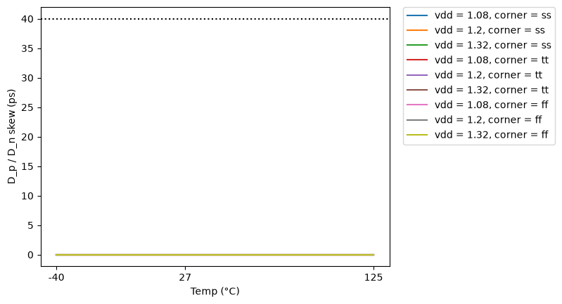
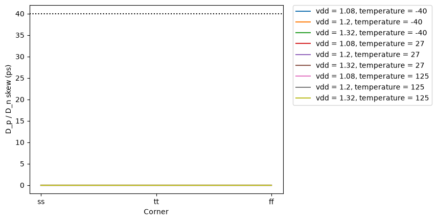
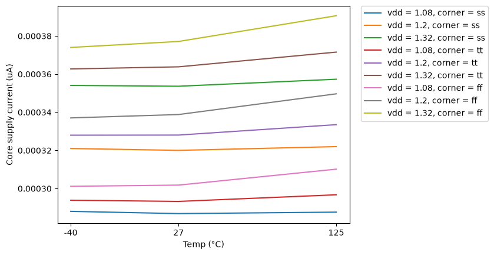

# CACE Summary for lvds_pattern

**netlist source**: schematic

|      Parameter       |         Tool         |     Result      | Min Limit  |  Min Value   | Typ Target |  Typ Value   | Max Limit  |  Max Value   |  Status  |
| :------------------- | :------------------- | :-------------- | ---------: | -----------: | ---------: | -----------: | ---------: | -----------: | :------: |
| Complementarity      | ngspice              | dsum_dev             |               ​ |          ​ |          any |    0.015 V |       0.25 V |    0.020 V |   Pass ✅    |
| D_p / D_n skew       | ngspice              | skew                 |               ​ |          ​ |          any |   9.300 ps |        40 ps |  29.000 ps |   Pass ✅    |
| Core supply current  | ngspice              | i_core               |               ​ |          ​ |          any | 328.039 uA |          any | 390.639 uA |   Pass ✅    |

## Plots

## skew_vs_temp

## skew_vs_corner

## icore_vs_temp

