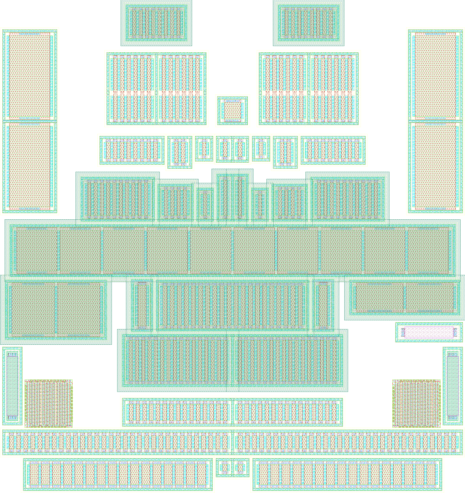

# `lvds_tx` layout

**`layout/lvds_tx.gds` is the layout**, and the only file in `layout/`. It
is edited by hand in KLayout: placement, routing, pins, everything. The one
exception is the device cells, every cell whose name starts with `dev_`.
They are generated from the schematic by the PDK's magic gencells, and
`make layout-pcells` regenerates them in place, and nothing else in the
file.

Run inside the IIC-OSIC-TOOLS container, in `macros/lvds_tx`:

```bash
make layout-view            # open layout/lvds_tx.gds in KLayout, edit mode
make layout-pcells-check    # what would a PCell update change? writes nothing
make layout-pcells          # regenerate the dev_* cells in layout/lvds_tx.gds
make klayout-drc            # sign-off DRC of layout/lvds_tx.gds
bash scripts/check_lvs.sh predriver_comp   # LVS of one cell, once it is routed
```

Status, 2026-09-28: **57.5 × 61.1 µm, every device placed, routing by hand
started in `predriver_comp`. `make klayout-drc` is clean.** Nothing is
connected yet, so there is no LVS. The placement was produced by the
generator that is now in `scripts/archive/`. Why every block sits where it
does is in `scripts/archive/README.md`, *The floorplan*.



## Two rules

1. **Never draw inside a `dev_*` cell.** The next update puts the
   generator's geometry back. The report lists that cell as *ersetzt*, and
   the old version is in `layout/backups/`, but the edit is gone from the
   file.
2. **Never give a cell of your own a name starting with `dev_`.**

And keep the instance names. Every instance of a device cell carries the
name of its schematic device (`Mref`, `M6_0`, `Mldo`, …) as GDS property 61.
KLayout shows it under *Instance Properties → User Properties* and keeps it
on copy and move. That property is how an update knows which device an
instance is.

**Save in KLayout before an update and reload afterwards** (*File →
Reload*). The update writes the file on disk. KLayout keeps working on the
copy it read, and saving that copy would undo the update.

## What an update does

`scripts/pcells/update_pcells.sh` works through five steps:

1. It netlists the schematic.
2. It builds one magic gencell per distinct device geometry.
3. It patches the gencells' DRC errors out and DRCs every cell. A single
   error stops the update before `lvds_tx.gds` is touched.
4. It writes each cell to a GDS of its own in `build/pcells/gds/`.
5. `scripts/pcells/swap_pcells.py` takes those cells into `lvds_tx.gds`.

| what changed | what happens in `lvds_tx.gds` |
|---|---|
| a cell's geometry, under the same name (a `gen_devices.py` default, a `patch_cells.py` repair) | the cell's content is replaced in place. Instances stay where they are. A gencell is drawn around its origin, so a cell that changed size changed it about its centre: the report says `GROESSE` and gives the old and new size. Check the neighbours |
| a device's cell name: `w`, `l` or `ng` in the schematic, or its options in `devices.py` | every instance of that device is pointed at the new cell, in the same position and orientation. The old cell is deleted once nothing uses it |
| a device new in the schematic | its cell is added as a top cell and reported as not placed. Place it by hand, with the device name as property 61 |
| a device gone from the schematic | its instance is reported, not deleted. That is left to you |
| everything else | untouched. Every cell that is not a device cell is compared before and after, and the file is written only if those comparisons match |

Before it writes, the update copies the file to
`layout/backups/lvds_tx_VOR_pcells_<date>.gds`. If `lvds_tx.gds` was saved while
the update ran, it stops without writing. `make layout-pcells-check` runs
the same steps and only reports.

## Hierarchy

One cell per subcircuit, named after it, so the cell open in KLayout is the
cell open in xschem:

| Cell | Blocks | Size | What it holds |
|---|---|---|---|
| `lvds_tx` | 2 | 57.5 × 61.1 µm | `Xpd`, `Xdrv` |
| `Driver` | 25 | 57.5 × 57.7 µm | H-bridge, CMFB amplifier with `Cc`/`Rc`, tail and its `tail_n` caps `Ctn1`/`Ctn2`, damping caps. `Cop`/`Con` stand up beside the pre-driver |
| `predriver` | 4 | 41.9 × 28.2 µm | two comparators, the stage, `MRef` |
| `predriver_stage` | 16 | 41.9 × 9.7 µm | the two three-inverter chains and the cross-coupling, as two rows without guard rings (*The stage: rows and tap strips*) |
| `predriver_comp` | 5 | 12.9 × 15.8 µm | one differential comparator (`Mt` in two halves, `Mld|Mlo` one cell) |

A device written `m=n` in the schematic is `n` instances, `<name>_0` to
`<name>_<n-1>`. gencell does not strap the gates between the rows of an
`m>1` device, so the rows are placed separately. `Driver` therefore has 25
blocks for the schematic's 22 devices (`M6`, `Cop`, `Con` are `m=2`).

## Files

Paths from `macros/lvds_tx`:

| | |
|---|---|
| `layout/lvds_tx.gds` | **the layout** |
| `layout/backups/` | KLayout's autosaves, and the copy made before every update, not in git |
| `docs/layout.md` | this file |
| `docs/routing.md` | the routing plan, net by net (German) |
| `scripts/check_lvs.sh` | KLayout LVS of one cell against its schematic, results in `build/lvs_<cell>/` |
| `scripts/pcells/update_pcells.sh` | the PCell update (`make layout-pcells`) |
| `scripts/pcells/devices.py` | reads the netlist into subcircuits and devices. Names the cells, holds the per-device options (`GENCELL_OVERRIDES`) and the devices drawn as one cell (`MERGED`) |
| `scripts/pcells/gen_devices.py` | the gencell options every device gets, and the magic Tcl that builds the cells |
| `scripts/pcells/patch_cells.py` | what gencell cannot do itself: the DRC repairs, guard rings opened or pushed back out |
| `scripts/pcells/swap_pcells.py` | takes the new cells into `layout/lvds_tx.gds` |
| `scripts/pcells/magfile.py`, `scripts/pcells/*.tcl` | the `.mag` reader and writer, and the magic batch scripts (DRC per cell, GDS per cell) |
| `scripts/archive/` | the placement generator, the pre-driver's scripted routing and the text views. They are not maintained and no make target calls them. `scripts/archive/README.md` |
| `build/` | everything an update or LVS run leaves behind, not in git |

## Device options

Every MOSFET gets these in `gen_devices.py`. A single device can override
them in `devices.py:GENCELL_OVERRIDES`.

| | |
|---|---|
| `viasrc 0 viadrn 0` | **source and drain end on metal1.** No via1 and no metal2 over the fingers, so that metal2 is free for routing. It costs no area: the guard ring sets the cell size |
| `viagate 100` on `l < 2 µm` | the gate rail comes up to metal2 (0.29 µm, a via1 on every finger). The plain 0.16 µm metal1 rail has no room for the metal1 a via1 needs. The rail is a 0.2 µm core with a bump over each via, so fill it out to its bounding box before connecting to it (M2.b notches otherwise) |
| `conn_gates 0 polycov 50` on `l ≥ 2 µm` | one gate contact per finger (`G0`…`Gn`), shortened. That opens a 0.99 µm metal1 corridor between the pads, so source and drain can reach the ring on metal1 |
| `guard 1` | every device has its own guard ring, and the ring *is* the `B` terminal. PMOS rings are Va, NMOS rings Vss |

Per device (`GENCELL_OVERRIDES`):

* `topc 0` / `botc 0`: gate contacted on one side only. The generator then
  pulls the ring 0.19 µm closer, which breaks pSD.i1/pSD.d1, so
  `patch_cells.py` pushes it back out and re-centres the cell. The size
  stays the same. What you get is a gate contacted from one side only.
* `_open n|s`: `patch_cells.py` takes the ring's tap bar off that side,
  leaving a U. The well stays, and `B` moves onto what is left of the ring.
  A U is a weaker guard than a closed ring.
* `_keepname`: apply the options without letting them into the cell name.

Options are part of the cell name (`dev_n_w4_l0p45_ng6_opens_botc0`), so
changing one gives the device a new cell. The update re-points its
instances.

`rhigh`/`rppd` and `cap_cmomf` keep their metal2. The MOM cap *is*
interdigitated metal1–metal4.

**One cell for two transistors** (`devices.py:MERGED`). Two transistors
that share gate, source and bulk and have the same finger can be drawn as
one multi-finger cell: one ring round both, one gate rail through all
fingers in metal1. The even stripes are the common source. The odd stripes
are the drains, assigned to the members by `drains`. LVS adds up the fingers
per net and finds both devices. This is used once: the comparator load
`Mld|Mlo` is `Mldo`, drains `ABBA` (a common centroid), contacted at the
bottom only, so its sources run straight up into the ring in metal1.

**Tail under the pair.** The comparator tail `Mt` has the input pair's `l`
and finger count (two halves of six). It is contacted at the bottom with its
ring open at the top, and the pair is the mirror image of that. Placed with
the boxes overlapping by exactly 1.56 µm, the two open rings become one.
Every tail drain then runs straight up in metal1 into the pair source above
it, and net2 needs no metal2 except for one hop over the ring bar between
the halves.

## The stage: rows and tap strips

`predriver_stage` is built like a row of standard cells, not like the rest
of the block. Its 16 devices have **no guard ring** (`devices.py:
SUBCKT_OVERRIDES`, `guard 0`). The stage cell itself draws what the rings
did (built by `scripts/archive/rebuild_stage.py`, 2026-09-29):

```
y 9.74   ThickGateOx top
y 9.47   ptap strip (Vss): Activ + pSD, one contact row, metal1 pin "Vss"
         NMOS row      Mnp2   Mnp1  Mnp0 Mnxn | Mnxp Mnn0  Mnn1   Mnn2   top-flush
y 6.36   NWell top     (NMOS Activ 0.62 away, NW.d1)
         PMOS row      Mpp2   Mpp1  Mpp0 Mpxn | Mpxp Mpn0  Mpn1   Mpn2   bottom-flush
y 0.62   ntap strip (Va): Activ, one contact row, metal1 pin "Va"
y 0      NWell bottom  merges with Cc's NWell below, 0.85 um into it
         x -1.57 .. 1.81 ........ axis 19.40 ........ 36.99 .. 40.37
           strips only                                   strips only
```

* **Columns.** PMOS and NMOS of one inverter share a centre line, and every
  column has as many gates top and bottom. The right half is the mirror
  image (m90) of the left about the axis. PMOS cells are 0.3 µm into each
  other (one NWell), which leaves 0.94 µm of Activ and 0.98 µm of metal1
  between columns.
* **One NWell** over the whole PMOS row and **one ThickGateOx** over the
  whole stage, each reaching at least 0.27 µm past every Activ (TGO.a).
* **Gates on the inside only.** Every gate is contacted on the side facing
  the other row (`devices.py: MODEL_OVERRIDES`): PMOS `botc 0`, gate rail on
  top; NMOS `topc 0`, gate rail at the bottom. The two rails of a column
  face each other 0.5 µm apart, and nothing lies between the source stripes
  and their strip. A metal1 piece 0.51 µm long takes a source straight into
  Va or Vss. Tried on a copy with all 36 source stripes bridged: DRC clean.
* **The strips** are the old ring bar, made long: 0.30 µm Activ with metal1
  over all of it, 0.62 µm inside the NWell (NW.e1), 0.44 µm from the device
  Activ. The ptap's pSD is 0.41 µm from the NFET gates (pSD.j1 wants
  0.40 µm).
* **Length.** The strips run 3.38 µm past the outer PMOS on either side,
  x −0.95 … 39.75 µm, and the NWell and the ThickGateOx run with them.
  That is as far as the Driver allows: the NWell stops 0.51 µm short of
  `Cop`/`Con`, which puts the ThickGateOx exactly TGO.e's 0.86 µm from
  theirs. The ends are free of devices, room for vias from the strips to
  the supply.
* **Bulk.** The strips are the bulk connection: in the extracted netlist
  all 32 PMOS fingers have their bulk on `Va`, all 32 NMOS fingers on `Vss`.
  No device is more than a few µm from a tap (LU.a wants 20 µm).

On its own, a ring-less cell fails magic's LU.a/LU.b (no tap within 20 µm).
`check_drc_cells.tcl` counts those apart, on an `LU` line, and
`update_pcells.sh` reports them without stopping.

The stage is 1.7 µm lower than before. The comparators above were not
moved down: there are now 2.55 µm between the stage and them.

## Placing by hand

How close two device cells may sit, measured against the sign-off deck in
0.05 µm steps (`scripts/archive/spacing.py`). The numbers are between the cells'
bounding boxes:

| pair | clean | why |
|---|---|---|
| pmos–pmos | overlap 0.70–1.00 µm (0.85 used), or ≥ 1.8 µm | the nwell is the box. Two separate nwells need 1.8 µm (NW.b1). Overlapping, nwell and ThickGateOx merge while the tap rings stay apart. Anything in between is dirty |
| nmos–nmos | overlap 0.10–0.25 µm (0.175 used), or ≥ 0.8 µm | ThickGateOx has to merge (TGO.e) before pSD runs into the other ring |
| pmos–nmos | ≥ 0.5 µm | NW.f1, TGO.e; they cannot merge |
| rhigh, rppd, MOM cap | ≥ 0 µm to anything, MOM–MOM 0.25 µm | |
| equal pmos / nmos edges | overlap exactly 1.54 / 0.92 µm | **one shared guard ring**, contact bar on contact bar. Only when both cells are equally long along that edge and flush at both ends. 5 nm either way is dirty |
| nmos, rings open towards each other | overlap exactly 1.56 µm | one ring round both (*Tail under the pair*). One step less and ThickGateOx does not close, one step more and the gate poly tips come within 0.18 µm (Gat.b) |

A merge needs a real common edge (1.8 µm for pmos, 1.0 µm for nmos). Two
pmos merged through a third are one nwell, and inside one nwell NW.b's
0.62 µm applies, not 1.8. Every pmos bulk here is Va and every nmos bulk
Vss, so merging is also right electrically. Rings that are not shared are
0.24–0.54 µm apart, close enough to bridge in metal1.

## Things that cost time

- **`source /foss/tools/sak/sak-pdk-script.sh ihp-sg13cmos5l` first.** The
  container leaves `PDK` empty, or defaults to sg13g2 in a login shell.
  magic's gencells, xschem's symbols and KLayout's technology then go
  missing silently, with no error. The make targets and scripts here do it
  themselves.
- **The PDK registers only its HV standard cells as a KLayout library**
  (`tech/pymacros/sg13cmos5l_stdcell_hv.lym`). The core cells' GDS
  (`libs.ref/sg13cmos5l_stdcell/gds/`) is there, but nothing tells KLayout
  about it, so they are missing from the Instance dialog; `ihp-sg13g2` has
  the same gap. `klayout/pymacros/sg13cmos5l_stdcell.lym` in the repository
  root registers them as `sg13cmos5l_stdcell`, and `make layout-view` puts
  `klayout/` on `KLAYOUT_PATH`. A layout that places them stores references
  to the library, so reopen it the same way, or the cells come up unlinked.
  KLayout's output goes to `/tmp/klayout_lvds_tx.log`.
- **`load <cell>` in a magic script needs `addpath`.** Without it magic does
  not find the file, silently creates an empty cell of that name, and DRCs
  nothing. `check_drc_cells.tcl` once reported every cell clean that way,
  one of them with 28 violations.
- **The PDK gencells are not DRC clean at their defaults.** `rhigh`/`rppd`
  stop the metal1 over the poly contact bar 0.025 µm short of CntB.h1
  (patched). At `viasrc/viadrn 100` the source/drain metal2 strap violates
  M2.b against the gate rail. That is moot with the vias off, and
  `patch_narrow_straps` is still there for the day they come back on.
- **Individual gate contacts do not scale down.** Below `l = 2 µm` the metal1
  over a single poly contact falls under M1.d (0.09 µm²), hence the threshold
  in `gen_devices.py`.
- **A `.mag` file's grid is not fixed.** magic writes `magscale 1 2` only
  when something sits on the 5 nm grid. Read a file without it as 5 nm and
  every coordinate halves, silently. `magfile.py` normalises on read.

## Next

1. Decide which metal layers the macro may use. The slot's power straps are
   vertical Metal4 over the whole project.
2. Route `predriver_comp`, `predriver_stage`, `predriver` and `Driver` by
   hand, following `docs/routing.md`. After each cell, run
   `bash scripts/check_lvs.sh <cell>`.
3. `lvds_tx`: supplies, `Iref_drv`/`Vref` down the axis, the pins.
4. `make klayout-lvs`, then PEX.
