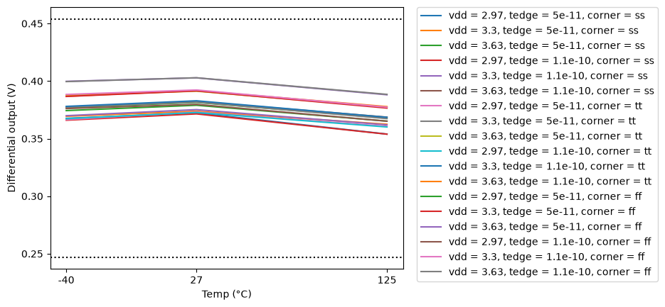
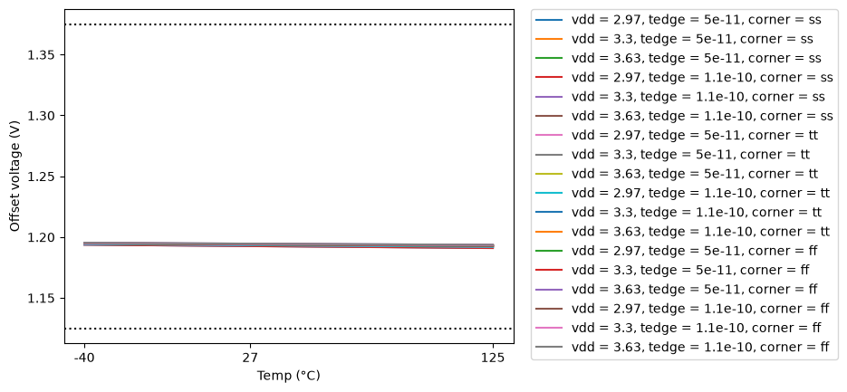
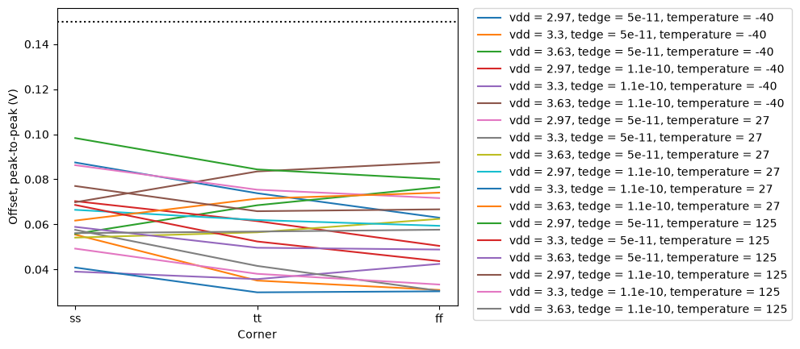
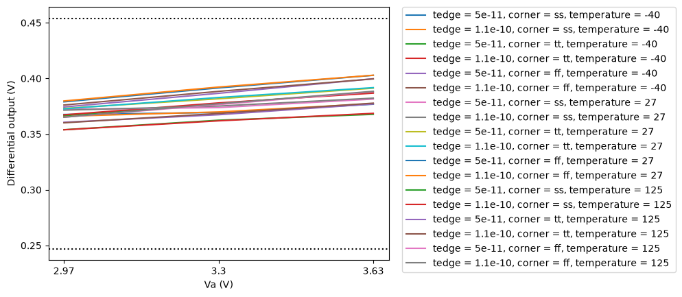

# CACE Summary for lvds_tx

**netlist source**: pex

|      Parameter       |         Tool         |     Result      | Min Limit  |  Min Value   | Typ Target |  Typ Value   | Max Limit  |  Max Value   |  Status  |
| :------------------- | :------------------- | :-------------- | ---------: | -----------: | ---------: | -----------: | ---------: | -----------: | :------: |
| Differential output  | ngspice              | vod                  |         0.247 V |    0.354 V |          any |    0.377 V |      0.454 V |    0.403 V |   Pass ✅    |
| Offset voltage       | ngspice              | vos                  |         1.125 V |    1.191 V |          any |    1.194 V |      1.375 V |    1.195 V |   Pass ✅    |
| Offset, peak-to-peak | ngspice              | vos_pp               |               ​ |          ​ |          any |    0.059 V |       0.15 V |    0.098 V |   Pass ✅    |
| Output rise time     | ngspice              | t_rise               |               ​ |          ​ |          any |  54.535 ps |       300 ps |  80.065 ps |   Pass ✅    |
| Output fall time     | ngspice              | t_fall               |               ​ |          ​ |          any |  55.514 ps |       300 ps |  81.441 ps |   Pass ✅    |
| Pulse skew           | ngspice              | t_skew               |               ​ |          ​ |          any |   0.735 ps |       100 ps |   1.559 ps |   Pass ✅    |
| Output duty cycle    | ngspice              | duty                 |            45 % |   50.000 % |         50 % |   50.000 % |         55 % |   50.500 % |   Pass ✅    |
| Supply current       | ngspice              | i_supply             |               ​ |          ​ |          any |   6.179 mA |          any |   6.878 mA |   Pass ✅    |

## Plots

## vod_vs_temp

## vos_vs_temp

## vos_pp_vs_corner

## vod_vs_vdd

