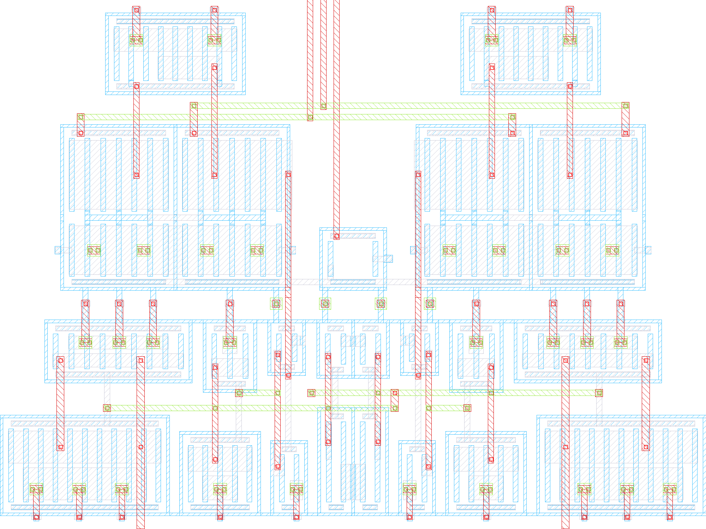

# Archive: the placement generator

Archived on 2026-09-28. Since then `layout/lvds_tx.gds` is the layout,
edited by hand in KLayout, and only its device cells are generated
(`scripts/pcells/`, `make layout-pcells`, see `docs/layout.md`).

What is here produced the placement `lvds_tx.gds` started from. It is kept
for reference, above all for *why* each block sits where it does. It is not
maintained, no make target calls it, and it does not run as it stands: it
expects `devices.py`, `magfile.py` and the leaf cells in `cells/` next to
it. Those are now in `scripts/pcells/` and `build/pcells/cells/`.

| | |
|---|---|
| `rebuild_stage.py` | 2026-09-29, one-off: `predriver_stage` rebuilt as two rows without guard rings, with a common NWell, one ThickGateOx and tap strips (`docs/layout.md`, *The stage: rows and tap strips*) |
| `make_floorplan.py`, `build_placement.py`, `spacing.py`, `floorplan.json`, `*.mag` | the placement generator: floorplan rules, placer, measured spacing rules, stored positions, and the magic hierarchy it wrote |
| `place_driver.py` | 2026-09-30: runs `plan_driver` alone with today's leaf cells (`build/pcells/cells/`) and puts the result into `layout/lvds_tx.gds` -- the Driver's instances only, plus `pd` moved with `Cc`. Without `--write` into `build/driver_regen/lvds_tx.gds`. New device cells first with `make layout-pcells ONLY=Driver` |
| `run_all.sh`, `build_cells.sh`, `check_drc.tcl`, `save_gds.tcl` | the flow that drove it |
| `merge_routed.py`, `check_untouched.sh`, `swap_cell.rb`, `verify_swap.rb` | how hand-routed cells and single device cells used to be carried across between the generator's GDS and the hand-edited one |
| `route_predriver.py` | the pre-driver's scripted routing. It was DRC and LVS clean on this placement, and was switched off over the metal-stack question |
| `ascii_layout.py`, `ascii_routing.py`, `*.txt` | text views of the placement and the routing |

The rest of this file is the layout README as it stood then, unchanged
except for image paths. File names in it are relative to what was then
`layout/`: the scripts are in this directory now, `ROUTING.md` is
`docs/routing.md`, and `lvds_tx_gen.gds` / `lvds_tx_merged.gds` no longer
exist.

---

# `lvds_tx` layout — placement stage

Magic layout of `schematic/xschem/lvds_tx.sch`, generated from the schematic
rather than drawn by hand. **This is the placement stage: every device and
every sub-block is instantiated and legally placed, and nothing is routed.**
A scripted routing of the pre-driver exists (`route_predriver.py`, DRC and
LVS clean) but is switched off while the metal stack is reconsidered — see
*Routing the pre-driver*.

```bash
docker exec iic-osic-tools_xserver bash -lc \
  'bash /foss/designs/chipalooza_lvds_pll/macros/lvds_tx/layout/run_all.sh'
```

That runs the whole flow — netlist, leaf cells, placement, DRC, GDS, KLayout
sign-off DRC, merge of the hand-routed cells — and prints a pass/fail
summary. `make layout-floorplan` does the same after rewriting
`floorplan.json` from `make_floorplan.py`.

Current status: **57.5 × 61.1 µm (3 512 µm²), 52 instances in five cells,
placed as a floorplan with every device at the least spacing the sign-off
deck allows. KLayout sign-off and magic `drc(full)` clean.** There is no LVS
in the flow: nothing is routed. It was 57.5 × 65.5 µm (3 770 µm²) until the
comparator tails `Mt` went from 140 to 35 µm (with `MRef` at `l=2u`, macro
README), 57.5 × 60.3 µm before the tails went under the input pairs
(*Tail under the pair*): six fingers stand taller than twenty.

The 1:15 bias pre-mirrors (`iref_x15`, the one hand-routed cell) are no
longer in here: they are their own macro, `macros/iref_x15`, placed at the
top level. That took the 20 µm row of the two mirrors off the top — the
block was 57.5 × 87.8 µm (5 050 µm²) with them.

## Hierarchy

One magic cell per subcircuit, named after it, so the cell opened in magic is
the cell being looked at in xschem:

| Cell | Blocks | Size | What it holds |
|---|---|---|---|
| `lvds_tx` | 2 | 57.5 × 61.1 µm | `Xpd`, `Xdrv` |
| `Driver` | 25 | 57.5 × 57.7 µm | H-bridge, CMFB amplifier and its compensation `Cc`/`Rc`, tail and its `tail_n` caps `Ctn1`/`Ctn2`, damping caps — `Cop`/`Con` stand up beside the pre-driver, the rest is 33.9 µm tall |
| `predriver` | 4 | 38.8 × 28.0 µm | two comparators, the stage, `MRef` |
| `predriver_stage` | 16 | 38.8 × 11.5 µm | the two three-inverter chains and the cross-coupling |
| `predriver_comp` | 5 | 12.9 × 15.8 µm | one differential comparator (`Mt` in two halves, `Mld|Mlo` one cell) |

Cells have no margin: their size is the extent of their devices.

`Driver` carries 25 blocks against the schematic's 22 devices because `M6`,
`Cop` and `Con` are written `m=2` there: gencell does not strap the gates between
the rows of an `m>1` device, so the two blocks are instantiated separately and
will be strapped by the router.

## Files

**Design data** — what KLayout, the Makefile and sign-off read.

| | |
|---|---|
| `lvds_tx.gds` | the user's working file — see *Who owns which file* |
| `lvds_tx.mag`, `Driver.mag`, `predriver*.mag` | the placement hierarchy, one cell per subcircuit, written by `build_placement.py` |
| `floorplan.json` | the block positions and orientations, kept across rebuilds |

**The flow**, in the order `run_all.sh` calls it.

| | |
|---|---|
| `run_all.sh` | the whole flow (`make layout`) |
| `devices.py` | reads `netlist/schematic/lvds_tx.spice` into a hierarchy of subcircuits, devices and instances. Converts the schematic's total `w` to the per-finger `w` gencell wants, and expands `m=n` into `n` instances |
| `build_cells.sh` | regenerates and DRCs the leaf cells, then checks the cells above (`make layout-cells`) |
| `gen_devices.py` | emits the Tcl that builds one leaf cell per distinct device geometry |
| `patch_cells.py` | repairs the two DRC errors the PDK gencells leave behind (see below) |
| `make_floorplan.py` | **the floorplan**: decides the arrangement of every cell row by row and writes it to `floorplan.json`; reads the arrangement of hand-routed cells back from `lvds_tx.gds` |
| `spacing.py` | how close two device cells may sit, by kind (pmos, nmos, rhigh, MOM cap) — measured against the sign-off deck — and the check that they do |
| `build_placement.py` | places each subcircuit and writes its `.mag`; keeps what `floorplan.json` already fixes, and holds it to `spacing.py` |
| `magfile.py` | reader/writer for magic `.mag` files. 1 internal unit = 5 nm |
| `check_drc*.tcl`, `save_gds.tcl` | the magic batch scripts |
| `merge_routed.py` | writes `lvds_tx_merged.gds`: the placement with the hand-routed cells of `lvds_tx.gds` put back in (`make layout-merge`) |
| `check_untouched.sh` | records and verifies that `lvds_tx.gds` was not written; `run_all.sh` and `build_cells.sh` end with it |

**Routing** — not run by the flow at the moment.

| | |
|---|---|
| `route_predriver.py` | the pre-driver's wiring, drawn into a GDS after magic wrote it (see *Routing the pre-driver*) |
| `check_lvs.sh` | KLayout LVS of one cell against its schematic (`bash check_lvs.sh predriver [gds]`, default `lvds_tx_gen.gds`), results in `build/lvs_<cell>/` |
| `ROUTING.md` | the routing plan, net by net |

**Text views** — to read the layout without a layout viewer.

| | |
|---|---|
| `ascii_layout.py` → `layout_ascii.txt` | the placement as text, every cell to scale (`python3 ascii_layout.py > layout_ascii.txt`) |
| `ascii_routing.py` → `routing_ascii.txt` | the connections as text: between the blocks (ROUTING.md plan), the pre-driver's wiring as `route_predriver.py` draws it — extracted and named after the schematic, with a check for shorts and opens — and the driver's planned wiring (`python3 ascii_routing.py > routing_ascii.txt`, in the container). `python3 ascii_routing.py predriver > routing_predriver.txt` gives the pre-driver alone, as one map of metal3/metal4 and one of metal2 |

**Build output** — not in git, rebuilt by every run.

| | |
|---|---|
| `lvds_tx_gen.gds`, `lvds_tx_merged.gds` | the generator's GDS, and the same with the hand-routed cells of `lvds_tx.gds` |
| `cells/` | the generated leaf cells |
| `build/` | everything else a run leaves behind: the log of every step (`netlist.log`, `cells.log`, `drc.log`, `gds.log`, `klayout_drc.log`, `klayout_drc_merged.log`), the KLayout DRC run directories, `lvs_<cell>/`, the state `check_untouched.sh` compares against |
| `backups/` | KLayout's autosaves of `lvds_tx.gds` |

## The floorplan

`make_floorplan.py` places every cell by hand-written rules, not by packing,
and says why in its docstrings. In short:

```
lvds_tx   (57.5 x 61.1 um, signal flow top -> bottom)

  Va  ======================================================  (top edge)
  [Cop]   [ kpm load ]          [ knm load ]   [Con]          predriver:
  [   ]   [ Mid|Mio  ]          [ Mio|Mid  ]   [   ]          each tail under
  [   ]   [ Mt  |  Mt]  [Mref]  [Mt  |  Mt ]   [   ]          its input pair,
  Vss ======================================================  with the
  [Cop][ Mpp2 Mpp1 Mpp0 Mpxn | Mpxp Mpn0 Mpn1 Mpn2 ][Con]     driver's load
  Va  ======================================================  caps beside it
  [[                         Cc                           ]]  Driver
  [[ Ctn1 ]      [M13][    M2    ][M14]      [  Ctn2   ]]
  [               [   M5   ][   M4   ]           [   Rc   ]]
  [Rp][Cxp]       [   M1   ][   M3   ]            [Cxn][Rn]
  [          M6_0          ][          M6_1          ]
     [     M11      ][M9][M10][     M12      ]
  Vss ======================================================  (bottom edge)
              Out_p                        Out_n              -> pads
```

* **One vertical axis through everything.** Every right-hand device is the
  mirror image (`m90`) of its left-hand twin: `M4` of `M5`, `M3` of `M1`,
  `M12` of `M11`, `knm` of `kpm`, the In_n chain of the In_p chain. The
  tail current flows straight down the axis, `M2` → `M5`/`M4` → `M1`/`M3` →
  `M6`.
* **The references sit next to what they mirror.** `M6` is two blocks side
  by side, one under each half of the bridge; `M9` (one finger) sits right
  under the joint between them, `M10` beside it next to the sources of
  `M11`/`M12` it feeds. `Mref` sits on the axis between the two
  comparators, level with their tails, whose gates are contacted at the
  bottom only: one metal2 bar at one height reaches all five gates.
* **Rails alternate** Va / Vss / Va / Vss from top to bottom, and
  every block puts its PMOS against a Va boundary and its NMOS against a
  Vss boundary — the stage is drawn NMOS-on-top for exactly that reason, and
  that is also what lets the blocks merge into each other: the stage's PMOS
  row shares its well with `Cc`, its NMOS row its ThickGateOx with the
  comparator tails.
* **Bias comes in on the axis** at the top: `Iref_pd` drops straight into
  `Mref`, `Iref_drv` runs down the axis to `M9`. Both are 30 uA; the 1:15
  pre-mirrors that make them from the 2 uA pins sit at the top level.
* **The flanks** hold the sense resistor and the cross cap of each
  output, on top of `M6` at the outer edge; the gap between them and the
  switches carries the Out trunk. The cross caps are turned so that `c1`
  (Out) faces the trunk: a `cap_cmomf` is metal1–metal4 all through,
  nothing can cross it.
* **The load caps `Cop`/`Con` stand upright beside the pre-driver.** They
  are gate capacitors, where only W·L counts, so two 10 × 5 µm halves on one
  shared guard ring (the PDK allows 10 µm per finger) hold the same gate
  area as 10 × 10 µm and fit the 8 µm the 17 µm narrower pre-driver leaves
  on either side. The driver cell reaches up past `Cc` there.
* **Outputs leave at the bottom**, where the analog pads are.

Rows are centred on the axis, so a device that changes size keeps its row
and its mirror partner.

### As close as the deck allows

Nothing keeps a fixed gap any more. Every row is pushed together, and every
row dropped onto what is below it, until `spacing.py` says stop — and what
it says was measured, not read from the manual: every pair of kinds, side by
side and stacked, at gaps from −1.4 to +2.0 µm in 0.05 µm steps, through
the sign-off deck. Between the `.mag` boxes:

| pair | clean | why |
|---|---|---|
| pmos–pmos | overlap 0.70–1.00 µm (used 0.85), or ≥ 1.8 µm | the nwell is the box. Two nwells need 1.8 µm (NW.b1: the deck cannot tell both are Va) — unless they overlap far enough that ThickGateOx (0.35 µm inside) merges too, while the tap rings (0.62 inside) are still apart. Anything in between is dirty |
| nmos–nmos | overlap 0.10–0.25 µm (used 0.175), or ≥ 0.8 µm | ThickGateOx sits 0.04 µm inside: it has to merge (TGO.e 0.86) before pSD (0.28 inside) runs into the other ring |
| pmos–nmos | ≥ 0.5 µm | NW.f1, TGO.e; they cannot merge |
| rhigh, MOM cap | ≥ 0 µm to anything, MOM–MOM 0.25 µm | |
| equal pmos / nmos edges | overlap exactly 1.54 / 0.92 µm | **one shared guard ring**: contact bar on contact bar (0.69–0.85 / 0.38–0.54 µm inside the box). Clean for every pair here, side by side and stacked, turned and mirrored — and dirty 5 nm either side of it, so only where both cells are equally long along the edge and flush at both ends |
| nmos, rings open towards each other | overlap exactly 1.56 µm (`JOIN`) | the lower cell's ring open to the north, the upper one's to the south, equally wide and flush: the side bars run into each other, **one ring round both, nothing between the two FETs**. Measured for the comparator's tail under its pair: one step less and the ThickGateOx the open sides leave notched does not close (TGO.e), one step more and the gate poly tips of the two rows come closer than 0.18 µm (Gat.b) — a little more and they would short, which DRC does not flag |

Two pmos merged through a third are one nwell, and inside one nwell the
rule is NW.b's 0.62 µm, not 1.8 — that is what lets a narrow pmos sit between
two that both merge into it. Merging also needs a real common edge (1.8 µm
for pmos, 1.0 µm for nmos, so that the joint in ThickGateOx is as wide as
TGO.f), which is why rows are aligned where they meet: the stage's PMOS
row flush at the bottom, its NMOS row flush at the top, `M9`/`M10` flush
with the top of `M11`/`M12`, `M2` fingered to the height of `M13`/`M14`.
It is also why `M9`/`M10` are in the bottom row and not between the two
`M6` blocks: a single 0.8 um finger is 0.8 um lower than an `M6` block, and
that step would face a row that then can no longer merge.

The mirror pairs share their ring: `M5|M4`, `M1|M3`, `M6_0|M6_1`, `M9|M10`,
the two comparator tails, `Mid|Mio`, `Mpxn|Mpxp`, `Mnxn|Mnxp`. `Mld` and
`Mlo` go one step further: they are one cell (see *One cell for two
transistors*), with no ring between them at all.
To their neighbours such a pair is one block (`spacing.combine`): where
four of them meet on the axis, the corner of one pair sits inside the shared
ring of the other, which on its own would be too short a joint to merge.

Merging is right electrically too — every pmos bulk in `lvds_tx` is Va,
every nmos bulk Vss. Where rings are not shared they end up 0.24 to 0.54 µm
apart, close enough to bridge with metal1 where the supply has to get
through.

There are no routing channels left. Metal1 stays in the devices, everything
from metal2 up runs over them, and the supplies are a TopMetal1 comb laid
over the block boundaries (`ROUTING.md`). A hand-routed cell (`ROUTED`,
see below) would be the one exception: nothing is pushed into it.

`floorplan.json` entries are `[x, y]` or `[x, y, orient]` in 5 nm units,
with KLayout's names for the orientation (`r90`, `m90`, …): `(x, y)` is
where the lower-left corner of the *turned* block lands. `build_placement.py`
still keeps whatever the file says and shelf-packs only blocks it has never
seen, on a fresh shelf above everything. `make layout-replace` still throws
the floorplan away and shelf-packs from scratch — which undoes this one;
`make layout-floorplan` is the way back.

### Finger counts changed for the floorplan

Only `ng` moved; W and L are exactly what they were, and every finger width
lands on the 5 nm grid. Done so that the devices of a row come out of
similar height and mirror pairs line up:

| Cell | Devices | `ng` | per finger |
|---|---|---|---|
| `Driver` | `M5`, `M4` | 40 → 16 | 5 µm |
| | `M2` | 12 → 20 | 4.86 µm |
| | `M6` | `w=24.8u m=4` → `w=49.6u m=2`, `ng=31` | 0.8 → 1.6 µm |
| | `M11`, `M12` | 20 → 16 | 2.5 µm |
| | `Cop`, `Con` | `w=10u l=10u` → `w=10u l=5u m=2` (gate area 100 µm² kept) | 10 µm, the PDK's limit |
| `predriver_comp` | `Mld`, `Mlo` | 1 → 4 | 3 µm, drawn together as one 8-finger cell `Mldo` |
| | `Mid`, `Mio` | 2 → 6 | 4 µm |
| | `Mt` | 14 → 20 → 2 × 6 | 7 µm, then 1.75 µm (`w=140u` → `35u` with `MRef` at `l=2u`), then 2.92 µm at `l=0.45u` in two halves under the pair (macro README) |
| `predriver_stage` | `Mpp1`, `Mpn1` | 2 → 4 | 3.13 µm |
| | `Mpp2`, `Mpn2` | 4 → 10 | 4 µm; 3.2 µm since 2026-10-02 (`w=32u`, macro README *Output crossing point*, `fix_stage_pmos32.py`) |
| | `Mnp1`, `Mnn1` | 1 → 2 | 2.5 µm |
| | `Mnp2`, `Mnn2` | 2 → 8 | 2 µm |

`predriver.tb` over tt 27 / ss 125 / ss −40 / ff −40 / ff 125 °C, the same
netlist with the old and with the new finger counts: |Vod| moves by at most
2 mV, the 20–80 % output edges by at most 2 ps, the delay from D to the
output drops by 15–37 ps, and the difference between high and low pulse
width shrinks in every corner (ss 125 °C: 63.5 → 39.4 ps, tt: 12.1 →
9.3 ps). `Driver.tb`: |Vod| 362 → 366 mV, edges 1.7 ps later, Vos −4 mV. `M2`
went to 20 fingers so that it is as tall as `M13`/`M14` (7.58 against
7.72 µm) and `Cc` can merge into all three; the figures above include it.

**`M6` is the one change that moves a number.** Half the fingers at twice
the width puts both blocks side by side in one row, but `M9`, the
reference of the 124:1 mirror, is still one 0.8 µm finger, and a 1.6 µm
finger is not two 0.8 µm ones (narrow-width effect). The tail current comes
out higher, and |Vod| with it:

| corner | tt 27 | ss 125 | ss −40 | ff −40 | ff 125 |
|---|---|---|---|---|---|
| \|Vod\| original | 360 mV | 343 mV | 367 mV | 368 mV | 350 mV |
| \|Vod\| now | 377 mV | 354 mV | 390 mV | 388 mV | 358 mV |
| change | +4.6 % | +3.3 % | +6.4 % | +5.4 % | +2.3 % |

Still well inside TIA/EIA-644-A (247–454 mV); delay and duty cycle as above.
Going back is `w=24.8u m=4` in the schematic and the old two-row `M6` in
`make_floorplan.py`, 1.4 µm taller.

`Cop`/`Con` are the one change to W/L, which for a capacitor is not what
matters: 424 → 429 fF at 1.25 V (+1.3 %), and in the benches |Vod| and the
edges move by less than 1 mV and 0.2 ps. No other capacitor would have
done: sg13cmos5l has no MIM, a MOM cap is 1.29 fF/µm² at best (2.2× the
area, and on metal2–metal4 only 0.92 fF/µm² while blocking the routing
over whatever it sits on), and `moscap_n`/`moscap_p` are thin oxide, not
rated for the 1.25 V output.

`Cc` and the new `Rc` are a circuit change, not a layout one — the CMFB loop
had no phase margin left in one corner; *CMFB compensation* in the macro
README has the numbers. For the floorplan it came free: ten fingers make `Cc`
(`w=50u`, was `w=40u ng=8`) 56.4 µm wide, which the driver row has room for,
and `Rc` (rppd, 1 × 6 µm) lies on top of `Rn` in the corner right of
`M4`/`M14`, below `Cc`. Not further left: below y 17 µm next to `M4` is where
the `Out_n` trunk and the drain straps of `M4` run.

`Ctn1`/`Ctn2`, the two PMOS caps from `tail_n` to Va that centre the output
crossing (*Output crossing point* in the macro README), came free as well:
they fill the two corners under `Cc` — `Ctn1` on top of `Rp`/`Cxp`, `Ctn2` on
top of `Rc` — sized to merge into `Cc` above and to keep NW.b's 0.62 µm from
`M5`/`M13` and `M14` beside them, which holds because all of them are one
nwell through `Cc`. `make_floorplan.py` puts them rather than dropping them:
dropped, they would stack on top of `Cc`. Splitting `Cop`/`Con` into two
halves made the driver cell 1.2 µm taller in the two corners beside the
pre-driver, where there was room.

## Routing the pre-driver

**Switched off for now.** `run_all.sh` no longer calls it, so
`lvds_tx_gen.gds` is placement only again. It uses metal1 to TopMetal1, and
the Chipalooza slot runs its power straps vertically in Metal4 over the
whole project (top-level README, *Floorplan Templates*) — which layers the
macro may use is being reconsidered first. To run it by hand on a copy:

```bash
python3 route_predriver.py lvds_tx_gen.gds build/lvds_tx_routed.gds
bash check_lvs.sh predriver build/lvds_tx_routed.gds
```

`route_predriver.py` draws the wiring of `predriver_comp`, `predriver_stage`
and `predriver` into a GDS after magic wrote it; `check_lvs.sh predriver`
then compares it with the schematic.
It is a scripted hand-routing — every wire written down, net by net, as
ROUTING.md sections 4–6 have it — but every position is taken from the
device cells in the file: the stripes, gate rails and guard rings found
there. A device that moves a little takes its wiring along; if the stage's
two halves stop being mirror images, or a gate bar misses its rails, the
script stops and says so.



```
predriver  38.8 x 27.3 um                      pins D_n D_p Iref (M3, top)
  TM1 Va    y 25.1-28.0  over Mld/Mlo           posts from their sources
  M4        y 21.7 / 22.3  D_n / D_p bus        drops onto the pair gates
  TM1 Vss   y  9.1-15.6  over the tails' sources and the stage's NMOS
  M4        y  6.4 / 7.2   stage cross tracks   net2+net3 / net1+net4
  TM1 Va    y  0.0- 3.0  under the stage's PMOS sources
                                                pins In_p In_n (M3, bottom)
```

* **Straps and rails.** Over every transistor two metal2 straps, drains on
  one, sources on the other, 0.25 µm from the gate rails (Mn.e). Sources
  face their supply: PMOS sources low in the stage, NMOS sources high.
  Gates are reached on their metal2 rails (`viagate`, *Device options*).
* **Supply posts.** A via stack from a source strap straight up to the
  TopMetal1 rail over it (2 × via2, 2 × via3, one TopVia1). Posts also reach
  down to a via on the guard ring, and the rings of a row are bridged ring to
  ring in metal1, so each cell is one Va and one Vss *on its own* — LVS
  compares every cell separately and would otherwise see a Vss split that
  only the rail one level up joins.
* **Comparators** (`predriver_comp`, mirrored as `knm`): the tail stands
  finger on finger under the input pair (*Tail under the pair*), so net2 is
  metal1 from each tail drain straight up into the pair source above, plus
  one short metal2 hop over the ring bar between the two halves. The load
  `Mld|Mlo` is one cell with one metal1 gate rail; `Mld`'s drain stripes run
  on down into it in metal1 (the diode), so net1 needs no strap there. The
  output drops in metal3 straight down to the stage input below. `Iref`: one
  metal2 bar through the bottom gate rails of all four tail halves and
  `Mref`, which sits between the comparators at their height.
* **Stage.** Per column a metal2 gate bar from the PMOS top rail to the
  NMOS bottom rail and a metal3 drain line; the horizontal nets on two metal4
  tracks. net2 and net4 both cross the axis, so the right half is the left
  half's mirror image with the tracks swapped. `Out_p` leaves downwards at
  x 8.14 (17.5 µm in `lvds_tx`, the driver's `In_p` line).
* **Kept free:** metal3 on the axis (x 18.68–20.10 in the pre-driver) for
  `Iref_drv` and `Vref` on their way down to the driver.

Verified while it was in the flow: KLayout sign-off DRC clean over the
whole `lvds_tx`, `check_lvs.sh predriver` — netlists match (hierarchically: `predriver`,
`predriver_comp`, `predriver_stage` each on its own). `Va` is joined by
name in that LVS (`--implicit_nets`): its two rails meet only in the
supply comb of `lvds_tx`.

magic has not seen the wiring — it goes into the GDS, not into the `.mag`
files — so `drc(full)` above still checks the placement only, and a magic
extraction of the pre-driver would find it unconnected.

## Hand-routed cells

A cell routed by hand in `lvds_tx.gds` goes into `ROUTED` in
`build_placement.py`, and from then on the generator decides nothing about
it:

* `make_floorplan.py` reads the device arrangement back from `lvds_tx.gds`
  — instances matched by name (GDS property 61), devices aligned on their
  centres because a leaf cell there need not have today's origin — so the
  generator's copy has the real footprint and the cells above are planned
  around it;
* `build_placement.py` does not check its spacing: how close its devices
  sit was decided by hand;
* `merge_routed.py` takes the cell and everything below it verbatim from
  `lvds_tx.gds` into `lvds_tx_merged.gds`, proves each of them identical
  (shapes by XOR, instances, texts), and puts the shift between the two
  copies' origins into the instances above instead of into the cell.

`ROUTED` is empty at the moment. The one cell that was in it, `iref_x15`,
became its own macro together with its routing (`macros/iref_x15`, where its
layout, its leaf-cell options and its magic overlap finding are described);
with nothing routed, `lvds_tx_merged.gds` is a copy of `lvds_tx_gen.gds`.

## One cell for two transistors

A guard ring between two devices is a metal1 wall: whatever connects them
has to go over it on metal2. Where two transistors share gate, source and
bulk and have the same finger, `devices.py:MERGED` draws them as one
multi-finger cell instead — one ring round both, one gate rail running
through all fingers in metal1. The cell's even stripes are the shared
source, its odd stripes the members' drains, in the order `drains` gives.
The schematic keeps the two devices; LVS extracts every finger and adds up
those on the same nets, so it finds them again.

Used once: the comparator load `Mld|Mlo` (gate net1, source Va) is `Mldo`,
`dev_p_w3_l0p4_ng8`, drains `ABBA` — `Mld` on the outer two, `Mlo` on the
inner two, a common centroid for the mirror. The diode is then closed in
metal1 as well: `Mld`'s drain stripes run straight into the gate rail. The
cell is contacted at the bottom only (`topc 0`), so its sources run
straight up into the guard ring (Va) in metal1 too — the ring needs no via
stack of its own. No area is saved, but inside the load only `Out` and the
Va strap under the supply posts are left on metal2. LVS of the routed copy:
match.

## Tail under the pair

The same idea across two transistors that do *not* share a gate: the
comparator's tail `Mt` (gate Iref) and its input pair `Mid|Mio` (gates
Din/Gin) only share net2, the tail's drain being the pair's source. `Mt`
has the pair's gate length and finger count (two halves of six, `m=2`),
and each half stands under one half of the pair, finger on finger: its
drains right under the pair's sources, its sources (Vss) under the pair's
drains.

For that nothing may lie between the two rows. `GENCELL_OVERRIDES` gives
`Mt` gate contacts at the bottom only (`topc 0`) and a ring open at the top
(`_open n`), the pair contacts at the top only and a ring open at the
bottom; placed at exactly `JOIN` (1.56 µm between the boxes, *As close as
the deck allows*) the two open rings run into each other and are one. Then:

* every tail drain runs straight up in metal1 into the pair source above it,
  and a metal1 bar in the 0.68 µm gap between the rows joins the three
  columns of each half — net2 needs metal2 only for one hop over the ring
  bar between the halves, no metal3 at all (it had two metal2 straps and
  four metal3 links);
* the four tail halves and `Mref` have their gate rails at one height, one
  metal2 bar.

It costs 0.8 µm of height: the comparators are narrower now (12.9 µm), and
the corner of a tail next to the stage's middle pair keeps them from
merging into the stage (0.8 µm apart instead of 0.175 µm overlapping).
LVS of the routed copy: match, in KLayout and in magic + netgen.

## Device options

Set in `gen_devices.py` for every MOSFET, or per device in
`devices.py:GENCELL_OVERRIDES`:

| | |
|---|---|
| `viasrc 0 viadrn 0` | **source and drain end on metal1.** No via1 and no metal2 over the fingers, so the router owns that metal2. Costs no area — the guard ring sets the cell size, not the strap |
| `viagate 100` on `l < 2 µm` | the gate rail comes up to metal2: the generator grows the metal1 rail to 0.21 µm, puts a via1 on every finger and a 0.29 µm metal2 rail over them. Needed because the plain 0.16 µm rail has 0.21 µm to the stripes on one side and to the ring on the other — no room for the metal1 a via1 needs, and on an l = 0.4 µm device not even between the stripes. The cell keeps its size. The generator's rail is a 0.2 µm core with a bump over each via, so the router fills it out to its bounding box before joining anything to it (M2.b notches otherwise) |
| `guard 1` | each device carries its own bulk tie. The ring *is* the `B` terminal: with `guard 0` the cell has no bulk connection at all |
| `conn_gates 1` | the fingers share one gate rail — one `G` terminal, but a wall between source/drain and the guard ring |
| `conn_gates 0 polycov 50` on `l ≥ 2 µm` | one contact per finger (`G0`…`Gn`) and a shortened contact, opening a 0.99 µm metal1 corridor between the pads so source/drain can reach the ring |

Per-device options (`topc`, `botc`, `_open`, `polycov`) are used by the
comparator's tail and pair (*Tail under the pair*); `iref_x15`'s README
lists the ones its cells were built with. `_open` now takes the side of a
turned or mirrored cell into account when the placer checks spacing
(`spacing.turned`). Via
coverage on the guard ring (`viagb`/`viagt`) does not combine with `viagate`:
the ring's metal2 lands 0.08 µm from the gate rail's.

`rhigh` and `cap_cmomf` keep their metal2: the MOM cap *is* interdigitated
metal1–metal4, and the resistor's cap is part of how the PDK generates it.

`_open` is not a gencell parameter — the generator draws the ring whole or
not at all. `patch_cells.py:open_guard_ring` takes the tap bar on that side
away afterwards and clips the two side bars back to it, leaving a U. The
well stays: it has to keep enclosing the FET, and it is not what blocks a
wire. The `B` terminal moves onto what is left of the ring, so the cell
still has a bulk connection. Both checkers pass, but a U is a weaker guard
than a closed ring — the latch-up path along the open edge is no longer
interrupted.

The one-sided gate contact does not save area. Dropping the row lets the
generator pull the guard ring 0.19 µm closer to the FET, which breaks the
0.43 µm FET-to-tap spacing (14 violations of pSD.i1/pSD.d1), so
`patch_cells.py:pad_guard_ring` stretches that side of the ring back out and
the cell ends up exactly the size it was. What it buys is a gate that is only
contacted from one side.

## Who owns which file

The generator and the person editing the layout do not share a file. This is
a rule, not an intention, and `check_untouched.sh` is what makes it testable.

| | |
|---|---|
| `lvds_tx.gds` | **the user's.** Nothing in this directory writes it, ever. KLayout saves here, sign-off reads it |
| `lvds_tx_gen.gds` | the generator's. Rewritten by every run, never edited by hand |
| `lvds_tx_merged.gds` | generator placement + hand-routed cells. Rewritten by every run — copy it to `lvds_tx.gds` to adopt it, never edit it in place |
| `cells/`, `build/`, `*.mag`, `floorplan.json` | generated, rebuilt at will |
| `backups/` | KLayout's autosaves, plus copies of anything ever rescued |

```bash
bash check_untouched.sh          # record the state of lvds_tx.gds
bash check_untouched.sh verify   # and prove afterwards that it is untouched
```

`make layout` and `make layout-cells` both end with `verify` reporting
`unveraendert: lvds_tx.gds`. When the generator's result should become the
working file, that is a copy the user makes, not something a script does.

`make layout-view` opens `lvds_tx_gen.gds` in a **new** KLayout window. It
does not close, kill or reload anything already open — a running editor is
the user's, and a script has no business ending it.

## The placement is sticky

`floorplan.json` holds the position of every block once it has been decided.
A rebuild reads it, keeps every instance exactly where it is, and only finds
room for what is new — so changing how a device is drawn, or adding one,
does not move the rest of the block. Without it the packer re-derived every
position from scratch on every run, which meant there was no way to touch a
device without redoing the whole layout.

New blocks go on a fresh shelf above everything. That is never the prettiest
answer, but it is always a legal one and easy to see. If a cell grew enough
that two blocks no longer clear each other, the run stops and names the
pair rather than writing an overlap:

```
Blöcke liegen zu dicht beieinander, weil eine Zelle gewachsen ist:
  Driver             M5 <-> M4
```

`make layout-floorplan` rewrites the stored positions from
`make_floorplan.py`. That is also what to run when the layout has drifted:
after an instance is renamed, the old position is orphaned and the new name
lands on a shelf of its own until the floorplan is written again.
`make layout-replace` throws everything away and shelf-packs from scratch.

`floorplan.json` is the one file here worth editing by hand — move a block
by changing two numbers, rebuild, and the router sees it.

## Rebuilding only the devices

`make layout-cells` regenerates `cells/` and stops there. The `.mag`
hierarchy and `lvds_tx.gds` are not touched, so a change to how the devices
are drawn — gate contacts, guard rings, via coverage — costs one minute
instead of the whole flow, and anything drawn into the GDS by hand survives.

That is only sound while the leaf cells keep their **names** and their
**sizes**. A new or vanished cell leaves an instance above pointing at
nothing; a cell that changed size leaves two blocks that used to clear each
other overlapping. `build_placement.py --check` recomputes the placement and
compares it against the `.mag` files on disk, and `build_cells.sh` runs it
last, so the rebuild always ends with one of:

```
Die Zellen oberhalb passen unveraendert - 6 Zellen geprueft, kein Neubau noetig.
Die Zellen oberhalb passen NICHT mehr:
  Driver             verweist noch auf dev_p_w5_l5_ng8
```

In the second case run `make layout`. Note that `lvds_tx.gds` stays stale
either way until the full flow writes it — the leaf geometry only reaches
KLayout through a new GDS.

Both paths now write `lvds_tx_gen.gds`, so a cells-only rebuild is visible
without the placement being redone and without `lvds_tx.gds` being involved
at all.

## Things that cost time

- **`load <cell>` in a magic script needs `addpath`.** Without it magic does
  not find the file, silently creates an empty cell under that name, and
  DRCs nothing — `check_drc_cells.tcl` reported every leaf cell clean for as
  long as the bug was in it, including cells with 28 violations. The
  hierarchical check and the KLayout deck were never affected: they read the
  real geometry, which is why the two disagreed the moment a leaf cell
  actually broke.
- **Individual gate contacts do not scale down.** `conn_gates 0` splits the
  gate rail into one contact per finger, which is what lets source and drain
  leave the device on metal1. Below 2 µm gate length the metal1 over a
  single poly contact falls under the 0.09 µm² minimum area (M1.d): 17 of 27
  cells fail at l = 0.4/0.45/0.5 µm, and 1 µm fails once `polycov` shortens
  the contact as well. Hence the threshold in `gen_devices.py`.
- **The gap between gate contacts does not grow with gate length.** It is
  the source/drain pitch, 0.42 µm on every device here, which is under the
  0.16 µm wire plus 2 × 0.18 µm spacing a metal1 track needs. `polycov` is
  what opens it: at 50 % the contact on a 2 µm gate shrinks from 1.86 to
  0.93 µm and the gap grows to 1.35 µm.
- **A `.mag` file's grid is not fixed.** magic picks the coarsest one the
  cell needs and writes `magscale 1 2` only when something sits on the 5 nm
  grid. Take the vias out of a device and the cell comes back with no
  `magscale` line at all, i.e. 10 nm per unit. Reading that as 5 nm halves
  every coordinate, which does not error — it produces a placement whose
  blocks sit on top of each other and 1059 DRC errors two steps later.
  `magfile.py` normalises on read.
- **The PDK gencells are not DRC clean at their defaults.** At
  `viasrc/viadrn 100` the source/drain metal2 strap stops 0.15 µm short of the
  gate rail, where rule M2.b wants 0.21, and every MOSFET carries spacing
  errors; at 80 the gap opens up, but on a 0.8 µm finger the strap then falls
  under the M2.d minimum area and has to be widened sideways. Both are moot
  now that the devices carry no metal2 — `patch_cells.py` keeps
  `patch_narrow_straps` for the day someone turns the vias back on. `rhigh`
  stops its metal1 cap 0.025 µm past the poly ContBar where CntB.h1 wants
  0.05 µm; that one still fires.
- **The netlist is build output.** `macros/lvds_tx/netlist` is in
  `.gitignore`, so `run_all.sh` regenerates it from the schematic before
  parsing it. A stale netlist cannot outlive the schematic it came from.
- **`source /foss/tools/sak/sak-pdk-script.sh ihp-sg13cmos5l` first.** The
  container leaves `PDK` empty, and without it magic's gencells and xschem's
  symbol paths are both missing — silently, not with an error.

## Next

1. Decide which metal layers the macro may use (the slot's power straps are
   vertical Metal4), then route the pre-driver and `Driver` within them —
   scripted as `route_predriver.py`, or by hand in `lvds_tx.gds` after
   adopting `lvds_tx_merged.gds` (a copy the user makes; a cell routed by
   hand goes into `ROUTED` in `build_placement.py`).
2. `lvds_tx`: supplies, `Iref_drv`/`Vref` down the axis, the pins.
3. LVS of `lvds_tx` and PEX.
