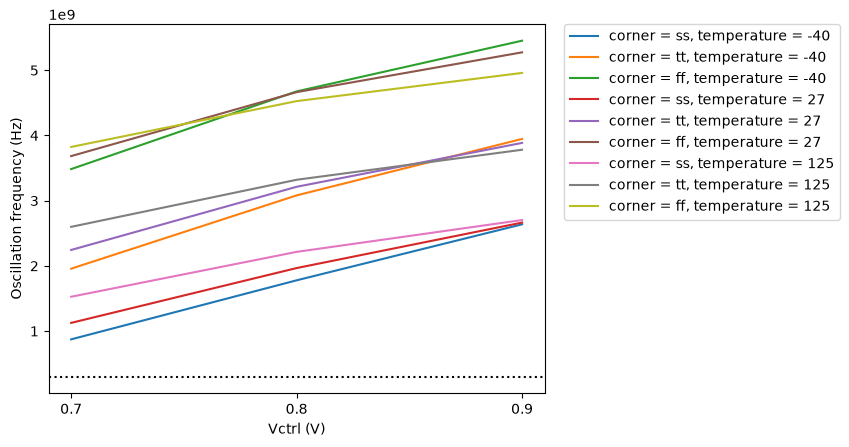
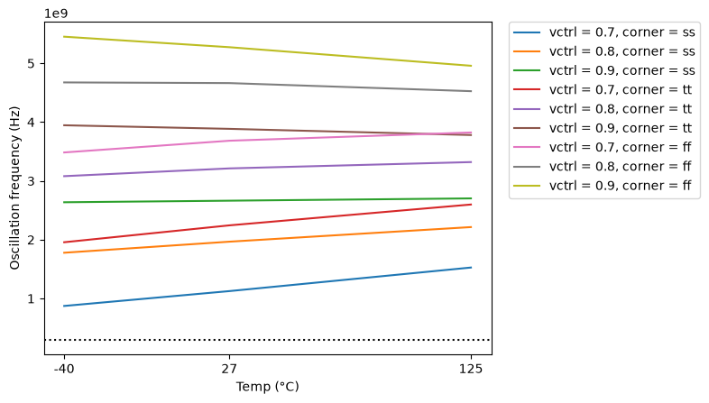
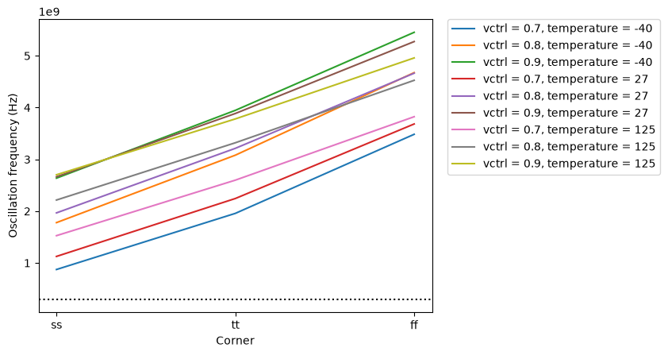
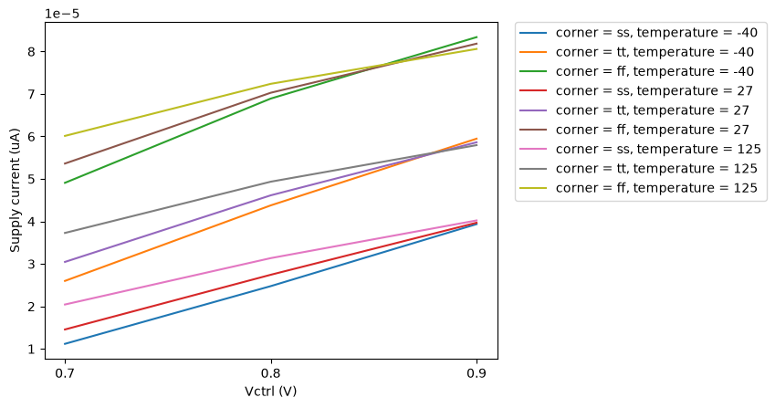

# CACE Summary for ring_oscillator

**netlist source**: schematic

|      Parameter       |         Tool         |     Result      | Min Limit  |  Min Value   | Typ Target |  Typ Value   | Max Limit  |  Max Value   |  Status  |
| :------------------- | :------------------- | :-------------- | ---------: | -----------: | ---------: | -----------: | ---------: | -----------: | :------: |
| Oscillation frequency | ngspice              | f_vco                |          3e8 Hz | 872793000.000 Hz |          any | 3212550000.000 Hz |          any | 5453100000.000 Hz |   Pass ✅    |
| Output swing         | ngspice              | v_swing              |           1.0 V |    1.235 V |          any |    1.259 V |          any |    1.369 V |   Pass ✅    |
| Supply current       | ngspice              | i_vco                |               ​ |          ​ |          any |  46.137 uA |          any |  83.369 uA |   Pass ✅    |

## Plots

## tuning_curve

## f_vs_temp

## f_vs_corner

## current_vs_vctrl

